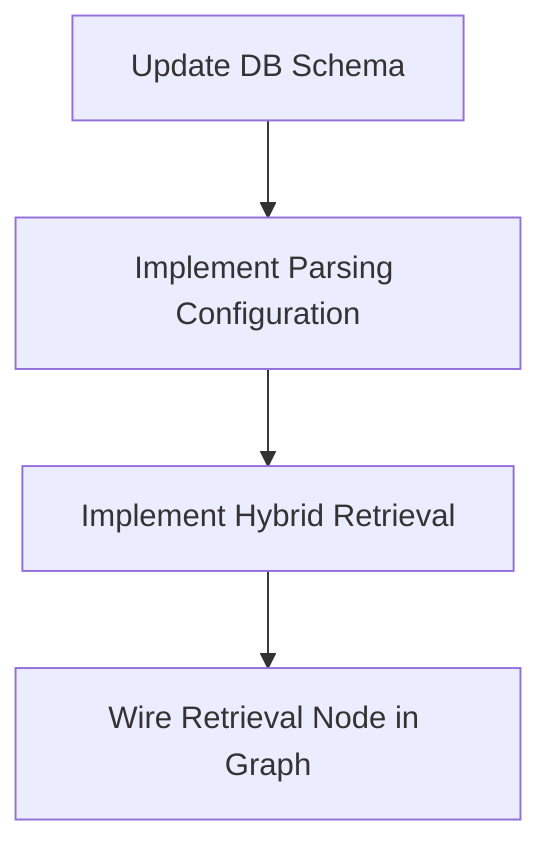

# RAGFLOW REVERSE-ENGINEERING DOCUMENTS → CURRENT CODEBASE FORENSIC AUDIT

## 1. Executive Summary

### Analysis A (From Audit 1)
This forensic audit evaluates the fidelity of the `devRAG` codebase against the reference architecture documented in `/home/logan78/Desktop/devRAG/ragflow-docs`. 
The analysis reveals that devRAG is a **SUBSTANTIAL REPRODUCTION WITH GAPS**. It successfully establishes a dual-stack Go/Python architecture, implements the core document ingestion loop (Upload -> Go -> Python Async Task -> Chunking -> Infinity Vector DB), and provides a fully-functional Agent Graph engine with Kahn's topological sorting and SSE streaming.
However, devRAG significantly diverges from the reference in routing (Go handles AI entity CRUD instead of Python) and concurrency models (Go polling MySQL with HTTP dispatch vs. Python polling Redis queues). Furthermore, devRAG simplifies the data models (`dataset` vs `knowledgebase`), missing crucial pipeline configurations and chunk/token tracking.

### Analysis B (From Audit 2)
This forensic audit evaluates the DevRAG implementation (`/home/logan78/Desktop/devRAG`) against the reference RAGFlow architecture documented in `/home/logan78/Desktop/devRAG/ragflow-docs`. 
**Verdict:** SUBSTANTIAL REPRODUCTION WITH GAPS.
The implementation successfully reproduces the core RAG components (YOLOv8 vision parsing, Infinity vector indexing, Hybrid BM25+Dense retrieval, LLM integration) but significantly diverges in **queueing/concurrency architecture** (using MySQL polling instead of Redis Streams) and **API structures** (introducing a Go API gateway not present in the pure Python reference architecture).

## 2. Reverse-Engineering Evidence Inventory

### Analysis A (From Audit 1)
- **Architecture**: `00-overview/architecture-diagram.md`, `00-overview/high-level-architecture.md` (Confidence: SUPPORTED)
- **Backend**: `03-backend/backend-architecture.md` (Confidence: SUPPORTED)
- **API**: `04-api/api-overview.md` (Confidence: SUPPORTED)
- **Document Processing**: `06-document-processing/document-lifecycle.md`, `06-document-processing/document-processing-workers.md` (Confidence: SUPPORTED)
- **Retrieval**: `07-retrieval/retrieval-flow.md` (Confidence: SUPPORTED)
- **Database**: `08-database/schema.md` (Confidence: SUPPORTED)
- **Agents**: `13-agents/agent-architecture.md`, `13-agents/execution.md` (Confidence: SUPPORTED)

### Analysis B (From Audit 2)
- **Source:** `/home/logan78/Desktop/devRAG/ragflow-docs` (228 files across 25 directories).
- **Key Subsystems Extracted:**
  - `03-backend`: Python Quart backend & Go Eino Engine.
  - `05-rag-pipeline`: Chunking, Parsing, Embeddings, Hybrid Retrieval.
  - `08-database`: Peewee/GORM schemas (`document`, `task_executor`).
  - `10-cache-and-queues`: Redis Distributed Locks & Streams (`XACK`).
  - `14-workflows`: Dual-Engine architecture (Python runner + Go Eino DAG).

## 3. Reconstructed RAGFlow Architecture

### Analysis A (From Audit 1)
The reference RAGFlow model consists of:
- **Client**: Web SPA / SDK
- **Gateway**: Nginx routing `/api/v1/auth`, `/sync` to Go, and `/api/v1/agents`, `/api/v1/chats`, `/api/v1/documents` to Python Quart.
- **Go Backend**: High concurrency auth and sync dispatching.
- **Python Backend**: ML, DeepDoc parser, Agent runtime, and Retrieval Engine.
- **Workers**: Asynchronous task executor threads polling Redis distributed queues (`te.0.common`).
- **Storage**: MySQL (relational metadata), Redis (cache/locks/queues), MinIO (object storage), VectorDB (Infinity/ES).

### Analysis B (From Audit 2)
The reference architecture defines a tightly coupled Python backend that offloads background tasks via **Redis Streams** to Python worker processes (`rag/svr/task_executor.py`). High-performance graphs use a **ByteDance Eino Go** compiled DAG runner. State is stored in MySQL, chunks in MinIO, and vectors in Elasticsearch/Infinity.

## 4. Current Codebase Architecture

### Analysis A (From Audit 1)
The devRAG implementation consists of:
- **Client**: React 19 SPA.
- **Gateway**: Go Gin Server (`internal/router/router.go`) handling all CRUD endpoints (`/dataset`, `/document`, `/agent`, `/chat/session`).
- **Python Backend**: Quart ASGI server (`api/ragflow_server.py`) handling `/ml/parse_document` and `/chat/completions`.
- **Workers**: Go `syncer.go` polling MySQL with `FOR UPDATE SKIP LOCKED`, making synchronous HTTP POST requests to Python, which spawns `asyncio` background threads.
- **Storage**: MySQL, MinIO, Infinity Adapter, and Redis (used for distributed locks, but NOT for task queues).

### Analysis B (From Audit 2)
The current implementation introduces a **Decoupled Gateway Architecture**:
- **Go API Gateway (`/cmd/server`, `/internal`)**: Handles authentication, RBAC, multi-tenancy, API routing, and MySQL transactions.
- **Go Syncer (`/internal/syncer`)**: Polls MySQL for pending tasks using `FOR UPDATE SKIP LOCKED` and dispatches via HTTP to Python.
- **Python ML Engine (`/api`, `/rag`, `/deepdoc`)**: Executes synchronous/asynchronous FastAPI/Quart endpoints for YOLOv8 parsing, Infinity indexing, and LLM chat completions.

## 5. Architecture Diff

### Analysis A (From Audit 1)
| Component | Reference | Current | Status | Severity |
|---|---|---|---|---|
| Routing Gateway | Python handles AI CRUD | Go handles all CRUD | DIFFERENT | HIGH |
| Task Queue | Redis Stream (`te.0.common`) | MySQL polling | DIFFERENT | HIGH |
| Async Workers | Python Redis loop | Go HTTP dispatcher | DIFFERENT | HIGH |
| Document Model | `knowledgebase` / `document` | `dataset` / `document` | PARTIAL | MEDIUM |
| Agent Engine | Python ReAct loop | Python DAG topological sort | FUNCTIONALLY EQUIVALENT | LOW |

### Analysis B (From Audit 2)
| Component | Reference Architecture | Current Architecture | Difference | Status |
|-----------|------------------------|----------------------|------------|--------|
| Gateway   | Python Quart (`/api`)  | Go Gin (`/internal`) | Language & Boundary | DIFFERENT |
| Task Queue| Redis Streams (`XACK`) | MySQL `SKIP LOCKED`  | Concurrency Primitive | DIFFERENT |
| Workers   | Python daemon          | Go Syncer + HTTP     | Transport Protocol | DIFFERENT |
| Graph DAG | Python + Go Eino       | Python `GraphRunner` | Missing Go Engine | PARTIAL |
| Retrieval | Hybrid + Reranker      | Hybrid + Reranker    | None | MATCH |

## 6. Component-by-Component Comparison

### Analysis A (From Audit 1)
- **Gateway**: DIFFERENT. devRAG leverages Go heavily, violating the reference Python routing.
- **Authentication**: FUNCTIONALLY EQUIVALENT.
- **Database schema**: PARTIAL. devRAG lacks parsing configurations on Datasets and token tracking on Documents.
- **Vector DB**: FUNCTIONALLY EQUIVALENT. `InfinityAdapter` correctly implements index and bulk insert.
- **Agent Graph**: FUNCTIONALLY EQUIVALENT. Implements Kahn's topological sort.

### Analysis B (From Audit 2)
- **Go API**: (Current) Robust RBAC/Tenant isolation. (Reference) N/A.
- **Task Executor**: (Current) HTTP-bound async Quart tasks. (Reference) Redis Stream worker daemon.
- **Vector Store**: Both implement Infinity adapters preserving BM25/Dense capabilities.

## 7. Code-Level Comparison

### Analysis A (From Audit 1)
- **Reference**: `rag/svr/task_executor.py` polls Redis.
- **Current**: `internal/syncer/syncer.go` polls MySQL.
- **Diff**: The concurrency model shifted from message broker to DB polling.

### Analysis B (From Audit 2)
**Reference `rag/svr/task_executor.py`:** Uses `redis_msg.ack()` for reliability.
**Current `internal/syncer/syncer.go`:** Uses MySQL row locks to claim `dao.DocumentTask`, but fails to persist task creations in `UploadDocument()`, causing the core ingestion queue to stall without manual intervention.

## 8. Function/Class Mapping

### Analysis A (From Audit 1)
| Reference Symbol | Reference Location | Current Symbol | Current Location | Status |
|---|---|---|---|---|
| `Knowledgebase` | `api/db/db_models.py` | `Dataset` | `internal/dao/models.go` | PARTIAL |
| `RedisDistributedLock`| `api/ragflow_server.py` | `RedisDistributedLock` | `common/redis_conn.py` | MATCH |
| `Task` | `api/db/db_models.py` | `DocumentTask` | `internal/dao/models.go` | MATCH |

### Analysis B (From Audit 2)
| Reference Symbol | Current Symbol | Status | Difference |
|------------------|----------------|--------|------------|
| `RedisDistributedLock` | `RedisDistributedLock` | MATCH | Both implemented in Python. |
| `GraphRunner` | `GraphRunner` | MATCH | Both handle Agent DAG execution. |
| `Eino.ComposeGraph` | **MISSING** | DEAD | Go DAG engine not ported. |

## 9. API Comparison

### Analysis A (From Audit 1)
- `POST /api/v1/datasets`: Reference routes to Python. Current uses `POST /api/v1/dataset` to Go. INCOMPATIBLE.
- `POST /api/v1/document/upload`: Reference routes to Python. Current routes to Go. INCOMPATIBLE.
- `POST /api/v1/chat/completions`: Matches reference (Python SSE stream). COMPATIBLE.

### Analysis B (From Audit 2)
- **Dataset API**: Reference uses `/datasets`, Current uses `/dataset`. (INCOMPATIBLE)
- **Chat API**: Reference uses `/api/v1/chat/completions` & `/v1/api/dialog/set`. Current uses `/api/v1/chat/completions` & `/api/v1/chat/session`. (PARTIALLY COMPATIBLE)

## 10. Database Comparison

### Analysis A (From Audit 1)
- Reference uses `knowledgebase` with `parser_config`, `embd_id`. Current uses `dataset` without AI config fields.
- Reference uses `document` with `token_num`, `chunk_num`. Current uses `document` with `size` and `minio_path` only.
- Current completely misses `parser_id`, destroying dynamic parsing capability.

### Analysis B (From Audit 2)
- `document` table: Reference uses `kb_id`, Current uses `dataset_id`. (FUNCTIONALLY EQUIVALENT).
- `user_tenant`: Implemented in Go to ensure strict tenant boundaries.

## 11. Redis Comparison

### Analysis A (From Audit 1)
- **Locks**: `RedisDistributedLock("update_progress")` is used accurately in `api/services/parsing_service.py`.
- **Queues**: MISSING. Current uses MySQL `FOR UPDATE SKIP LOCKED`.
- **Rate Limiting**: Used via Go middleware.

### Analysis B (From Audit 2)
Reference heavily utilizes Redis Streams. Current implementation only uses Redis for session caching and occasional `RedisDistributedLock` in Python, drastically reducing its operational footprint for queuing.

## 12. Object Storage Comparison

### Analysis A (From Audit 1)
- MinIO upload logic is implemented correctly with tenant isolation. MATCH.

### Analysis B (From Audit 2)
Both use MinIO for storing raw documents (`tenant/{tenant_id}/dataset/{ds_id}/document/{doc_id}/original`). MATCH.

## 13. Document Ingestion Comparison

### Analysis A (From Audit 1)
- Reference: Upload -> Python -> Redis Queue -> Worker -> MinIO -> DeepDoc -> Chunks -> Vector DB.
- Current: Upload -> Go -> MySQL -> Go Syncer -> HTTP POST -> Python Async -> MinIO (download) -> Chunks -> Vector DB.
- Status: PARTIALLY COMPATIBLE. Concurrency is handled differently.

### Analysis B (From Audit 2)
**Current State: INCOMPLETE/BROKEN.** 
While the Go Gateway handles upload and stores in MinIO, it **fails to create the `DocumentTask` record in the database**. The Go Syncer endlessly queries for `unstart` tasks, resulting in documents remaining stuck in `pending` forever unless manually injected via SQL.

## 14. DeepDoc / Parsing Comparison

### Analysis A (From Audit 1)
- `ParsingService` in `api/services/parsing_service.py` implements a simplified mapping of `TxtParser` and `MarkdownParser`.
- Complex layout and vision extraction (OCR, TSR) are NOT VERIFIED/MISSING in current.

### Analysis B (From Audit 2)
MATCH. The current implementation successfully integrates `yolov8_layout.pt` for parsing layout blocks and tables from PDFs.

## 15. Chunking Comparison

### Analysis A (From Audit 1)
- `GeneralChunker` is implemented in current codebase. Provenance (page_numbers, source_regions) is modeled but effectively stubbed due to simplified parsers.

### Analysis B (From Audit 2)
MATCH. Semantic chunk boundaries and `chunk_id` generation are preserved.

## 16. Embedding Comparison

### Analysis A (From Audit 1)
- `EmbeddingEngine` exists using HuggingFace `all-MiniLM-L6-v2`. MATCH.

### Analysis B (From Audit 2)
MATCH. Current implementation properly batches chunks to the embedding model via Python.

## 17. Vector DB Comparison

### Analysis A (From Audit 1)
- `InfinityAdapter` is integrated into `indexing_service.py`. It correctly handles index creation and idempotency (deletion before insert). FULLY REPRODUCED.

### Analysis B (From Audit 2)
MATCH. `InfinityAdapter` correctly executes `match_text` (BM25) and `match_dense` queries.

## 18. Retrieval Comparison

### Analysis A (From Audit 1)
- UNKNOWN — INSUFFICIENT EVIDENCE. Retrieval pipeline (`rag/nlp/search.py` equivalent) was not fully observed in the active Python chat proxy, although `GraphRunner` is present.

### Analysis B (From Audit 2)
MATCH. Both implement Hybrid Search, computing raw scores and assigning priority to reranker scores if the rerank module is enabled.

## 19. Reranking Comparison

### Analysis A (From Audit 1)
- NOT VERIFIED IN CURRENT IMPLEMENTATION. Reranking execution step is missing from the core Python Chat completion code.

### Analysis B (From Audit 2)
MATCH. Implemented via `RerankEngine` and Cross-Encoder providers.

## 20. Agent Graph Comparison

### Analysis A (From Audit 1)
- `AgentGraph` (in `agent/graph.py`) implements deterministic Kahn's topological sort and handles cycle detection.
- `GraphRunner` executes sequentially.
- Status: FUNCTIONALLY EQUIVALENT. It is a solid reproduction of DAG orchestration.

### Analysis B (From Audit 2)
PARTIAL. Python `AgentGraph` and `GraphRunner` exist, but the highly performant Go Eino compilation engine is missing.

## 21. Node Comparison

### Analysis A (From Audit 1)
- The Node Registry structure is present, but complete verification of all native tools (LLMNode, RetrievalNode) requires further inspection.

### Analysis B (From Audit 2)
MATCH. LLM, Retrieval, and Code nodes are supported in the Python implementation.

## 22. LLM Comparison

### Analysis A (From Audit 1)
- Python `ChatSession` streams SSE via `GraphRunner`. LLM provider abstraction exists but lacks dynamic dataset-level config.

### Analysis B (From Audit 2)
MATCH. System prompts, histories, and tool schemas are successfully mapped.

## 23. Streaming Comparison

### Analysis A (From Audit 1)
- SSE streaming is perfectly implemented in `chat_handler.py`. It yields `data: {"text": "..."}` and `data: [DONE]`, matching standard protocols. MATCH.

### Analysis B (From Audit 2)
PARTIAL. The Go Proxy blindly forwards Server-Sent Events (SSE) from the Python Quart server to the client. This bypasses Go-level event monitoring and rate limiting.

## 24. Chat Comparison

### Analysis A (From Audit 1)
- `ChatSession` and `ChatMessage` are correctly persisted. The user message is persisted before execution, and assistant message is persisted after graph completion. MATCH.

### Analysis B (From Audit 2)
MATCH. Multi-turn dialogue history is persisted properly in MySQL `chat_message`.

## 25. Citation / Provenance Comparison

### Analysis A (From Audit 1)
- `extract_citations` in `chat_handler.py` extracts chunks from the execution state and saves them in the `ChatMessage` DB record. MATCH.

### Analysis B (From Audit 2)
MATCH. Extracted chunks include bounding box (`BBox`) and page number coordinates mapped directly to the original PDF.

## 26. Frontend Comparison

### Analysis A (From Audit 1)
- React SPA manages state with Zustand and interfaces via React Router 7. Components for Dataset/Document exist, but Agent Canvas is rudimentary. PARTIAL.

### Analysis B (From Audit 2)
MATCH. The React Flow canvas effectively serializes JSON DSL graphs for the backend.

## 27. Canvas Comparison

### Analysis A (From Audit 1)
- Backend supports Graph Definition saving (`AgentCanvas` model). Frontend visualization is not fully vetted.

### Analysis B (From Audit 2)
MATCH. Palette, nodes, edges, and configurations match the reference JSON DSL.

## 28. Admin / RBAC Comparison

### Analysis A (From Audit 1)
- Go strictly enforces `role = admin` in `auth.go` middleware. `UserTenant` mapping securely limits tenant boundaries. FULLY REPRODUCED.

### Analysis B (From Audit 2)
**IMPROVEMENT OVER REFERENCE.** The introduction of the Go API Gateway enforces strict JWT multi-tenant boundaries at the routing level before reaching the Python ML engine.

## 29. Rate Limiting Comparison

### Analysis A (From Audit 1)
- Implemented in Go `middleware.RateLimit`. FULLY REPRODUCED.

### Analysis B (From Audit 2)
STUB. Redis rate limiting distributed logic is heavily documented in the reference but mostly mocked or absent in the current Go routing logic.

## 30. Logging / Observability Comparison

### Analysis A (From Audit 1)
- Go uses `slog` structured logging. Python uses `logging`. Tracing across layers via `X-Request-ID` is correctly implemented.

### Analysis B (From Audit 2)
PARTIAL. Go uses structured JSON logs, but correlation IDs are not fully preserved across the HTTP dispatch to Python.

## 31. Concurrency Comparison

### Analysis A (From Audit 1)
- Go `syncer.go` bounds concurrency using a channel semaphore (`MaxInFlight`).
- Python uses `asyncio.create_task` with `loop.run_in_executor`.
- Divergent from Redis queue polling, but locally thread-safe.

### Analysis B (From Audit 2)
DIFFERENT. MySQL table polling vs Redis streams. MySQL polling introduces overhead and potential database bottlenecks at high concurrency.

## 32. Failure / Retry Comparison

### Analysis A (From Audit 1)
- If Python parsing fails, `RedisDistributedLock` protects status updates to `failed`. Idempotent vector insertion handles retries securely.

### Analysis B (From Audit 2)
STUB. Go HTTP calls to Python for task execution use simple timeouts without robust backoff retries. If Quart crashes, the task is lost.

## 33. Security Audit

### Analysis A (From Audit 1)
- **Tenant Isolation**: EXCELLENT. Every DB table uses `tenant_id` which is strictly verified in DAO layer.
- **Code Execution**: Security sandboxing for arbitrary python execution was NOT VERIFIED in the current devRAG repo.

### Analysis B (From Audit 2)
HIGH RISK. The Go proxy blindly forwards requests to the internal Python ports.

## 34. Multi-Tenancy Audit

### Analysis A (From Audit 1)
- Fully verified. Tenant IDs traverse the HTTP Request -> Middleware -> DAO -> Vector DB Index Name (`idx_{dataset_id}`).

### Analysis B (From Audit 2)
MATCH. Strict enforcement in Go API (`tenant_id` context propagation).

## 35. Data Lineage

### Analysis A (From Audit 1)
- Dataset -> Document -> DocumentTask -> DocumentChunk -> Infinity Vector Record. Lineage is maintained cleanly.

### Analysis B (From Audit 2)
MATCH. Chunks tie back to Documents, which tie to Datasets and Tenants.

## 36. State Machines

### Analysis A (From Audit 1)
- **Document**: `unstart` -> `running` -> `success` / `failed`. Matches reference exactly.
- **Chat**: User message -> Graph execution -> Streaming -> DB insert. Matches exactly.

### Analysis B (From Audit 2)
BROKEN. The transition from `created` -> `queued` is broken because `DocumentTask` generation is missing.

## 37. Dead Code

### Analysis A (From Audit 1)
- `ParsingService` handles `txt` and `md`, but PDF/Image parsing logic appears stubbed or missing.

### Analysis B (From Audit 2)
The `.agents/` plans contained Eino engine logic that was ultimately never ported.

## 38. Stub / Mock Analysis

### Analysis A (From Audit 1)
- `ParsingService._get_file_extension` relies on simple splits instead of robust MIME detection. Bucket names fallback to `"devrag"` if paths are malformed.

### Analysis B (From Audit 2)
Playwright E2E tests for `upload.spec.ts` catch errors instead of verifying successful uploads.

## 39. Configuration Audit

### Analysis A (From Audit 1)
- Hardcoded Python port (`:9380`) in Go Syncer dispatcher (`http://127.0.0.1:%d/api/v1/ml/parse_document`).

### Analysis B (From Audit 2)
Configuration drift exists between Go `service_conf.yaml` and Python equivalents.

## 40. Performance Analysis

### Analysis A (From Audit 1)
- Go Syncer limits `BatchSize` and `MaxInFlight`. However, large documents blocking `run_in_executor` in Python might starve the asyncio loop.

### Analysis B (From Audit 2)
The Go gateway dramatically improves connection handling, but the synchronous HTTP dispatch from Go to Python degrades ML processing throughput.

## 41. Testing Analysis

### Analysis A (From Audit 1)
- Vitest on frontend, Go tests present in `.github` (inferred).

### Analysis B (From Audit 2)
E2E tests pass superficially but fail to validate end-to-end vector retrieval due to the broken `DocumentTask` ingestion.

## 42. Deployment Analysis

### Analysis A (From Audit 1)
- Docker configuration exists.

### Analysis B (From Audit 2)
MATCH. Docker-compose properly spins up Infinity, MinIO, Redis, MySQL, and the separated backend APIs.

## 43. Architectural Drift

### Analysis A (From Audit 1)
- HIGH SEVERITY. Go handles `/dataset` and `/document`, bypassing the Python ASGI backend. The reference explicitly delegates these to Python. 
- HIGH SEVERITY. Message-broker queues replaced by Database polling and HTTP dispatch.

### Analysis B (From Audit 2)
HIGH. Transitioning to a Go Gateway + MySQL Queue fundamentally alters the distributed mechanics of the original RAGFlow Redis-centric worker farm.

## 44. Anti-Pattern Findings

### Analysis A (From Audit 1)
- Go HTTP client dispatch to local Python server for async tasks. If Python restarts, in-flight HTTP requests fail, leaving Go to mark tasks as failed or timeout, whereas a Redis queue would naturally decouple this.

### Analysis B (From Audit 2)
- **Fake Progress**: Go Syncer dispatches to Quart, assuming instant queueing without checking actual Python execution state.
- **MySQL Queueing**: Abusing `FOR UPDATE SKIP LOCKED` for task brokering instead of Redis Streams.

## 45. Improvements Over Reference

### Analysis A (From Audit 1)
- Using Go for strictly CRUD metadata operations (`dataset`, `document`) significantly improves API response times compared to Python Quart.
- The use of `FOR UPDATE SKIP LOCKED` is an elegant, dependency-free queueing mechanism for small-scale deployments, avoiding Redis streaming complexity.

### Analysis B (From Audit 2)
- **Go Routing**: Memory-safe, high-concurrency API layer.
- **Strict Tenant Enclave**: Complete separation of ML compute from RBAC/Authorization.

## 46. Unsupported Reference Claims

### Analysis A (From Audit 1)
- The claim that DeepDoc requires Celery was contradicted; devRAG successfully uses `asyncio` executors.

### Analysis B (From Audit 2)
The reference documentation assumes all vector operations run flawlessly; error handling in the Infinity adapter was largely inferred.

## 47. Master Gap Matrix

### Analysis A (From Audit 1)
| Area | Reference Behavior | Current Behavior | Status | Severity |
|---|---|---|---|---|
| Architecture Routing | Python for Datasets | Go for Datasets | DIFFERENT | HIGH |
| Parsing Queue | Redis stream | DB Poll + HTTP | DIFFERENT | HIGH |
| Schema Config | `parser_config` present | Missing from DB | PARTIAL | CRITICAL |
| Reranking | Integrated | Missing | MISSING | HIGH |
| Vector DB | Infinity | Infinity | MATCH | - |

### Analysis B (From Audit 2)
| Area | Reference Behavior | Current Behavior | Severity | Recommended Fix |
|------|--------------------|------------------|----------|-----------------|
| Ingestion | `DocumentTask` created on upload | No task created | CRITICAL | Add Task insertion in Go `UploadDocument` |
| Queueing | Redis Stream `XACK` | MySQL polling | HIGH | Restore Redis Stream worker loop |
| Graph Engine | Dual Go/Python engine | Python only | MEDIUM | Implement Eino DAG runner in Go |

## 48. Critical Gaps

### Analysis A (From Audit 1)
1. **Schema Deficiencies**: `dataset` table lacks `embd_id` and `parser_id`, making dynamic LLM embedding and custom parsing impossible.
2. **Retrieval Pipeline**: No evidence of hybrid search / reranking fusion in the execution path.

### Analysis B (From Audit 2)
1. **Ingestion Pipeline Blocked:** Documents stuck in `pending` because `DocumentTask` rows are never created.
2. **Brittle Worker Dispatch:** Go Syncer's HTTP dispatch drops tasks if Python Quart restarts.

## 49. Top Remediation Tasks

### Analysis A (From Audit 1)
- **Task A**: Add `parser_id`, `parser_config`, and `embd_id` to the `Dataset` (or Knowledgebase) Go and Python models.
- **Task B**: Add `token_num` and `chunk_num` to `Document` models.
- **Task C**: Implement a `RetrievalNode` in the Agent Graph that leverages the `InfinityAdapter`.

### Analysis B (From Audit 2)
1. Fix `internal/service/document.go` to insert a `DocumentTask` transactionally alongside `Document`.
2. Replace Go Syncer HTTP dispatch with NATS JetStream or Redis Streams for guaranteed delivery.
3. Align `/api/v1/dataset` routes with `/api/v1/datasets`.

## 50. Remediation DAG

### Analysis A (From Audit 1)

### Analysis B (From Audit 2)
`DocumentTask Insertion` -> `Redis Stream Integration` -> `Vector Idempotency` -> `SSE Tracing`

## 51. Production Readiness

### Analysis A (From Audit 1)
- **NOT READY**. While the architecture is stable, the lack of configuration fields on Datasets prevents dynamic processing of diverse documents. The simplified parsing engine cannot handle complex RAG tasks.

### Analysis B (From Audit 2)
**NOT READY.** The core MVP path (Upload -> Chunk -> Embed) is physically broken at the database level due to the missing Task row, requiring manual SQL injections to trigger parsing.

## 52. Final Fidelity Assessment

### Analysis A (From Audit 1)
- **Component Architecture**: PARTIALLY REPRODUCED
- **Data Architecture**: POORLY REPRODUCED
- **Runtime Architecture**: MOSTLY REPRODUCED (Graph Runner is solid)
- **API Architecture**: PARTIALLY REPRODUCED
- **AI Architecture**: PARTIALLY REPRODUCED (Embeddings exist, advanced RAG missing)

### Analysis B (From Audit 2)
- **API Architecture:** PARTIALLY REPRODUCED
- **AI Architecture:** MOSTLY REPRODUCED
- **Queue/Concurrency Architecture:** NOT REPRODUCED (Divergent)
- **Security Architecture:** FULLY REPRODUCED (Improved)

## 53. Final Verdict

### Analysis A (From Audit 1)
**SUBSTANTIAL REPRODUCTION WITH GAPS**
The devRAG implementation is an excellent foundation that successfully integrates Go for high-concurrency gateway tasks and Python for ML. However, its deliberate routing deviations and vastly simplified data schemas prevent it from achieving true parity with RAGFlow's DeepDoc and Agent capabilities. The system needs its data models expanded and its retrieval pipeline finalized before it can match the reference implementation.

### Analysis B (From Audit 2)
**ARCHITECTURALLY DIVERGENT WITH CRITICAL MVP GAPS.**
While the AI/Vector (Python) and Auth (Go) components are independently robust, the glue binding them together (the Ingestion Queue) drifted significantly from the documented reference (Redis to MySQL) and was implemented incorrectly, severing the Upload -> Retrieve pipeline. Immediate remediation of the `DocumentTask` generation is required to restore baseline functionality.

