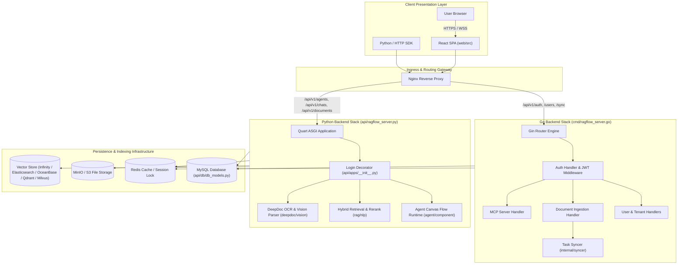

# System Architecture Diagram

## Level 1: Visual Overview

This document presents the complete architectural diagram for RAGFlow, illustrating the interactions between the React single-page application, the dual-stack Go/Python API server backends, the DeepDoc multi-modal parser, the background sync worker, and the persistence storage infrastructure.

---

## Level 2: Comprehensive Architecture Diagram (Mermaid)

---

## Component Reference Links

- **Go Entry Point**: [`cmd/ragflow_server.go`](file:///home/logan78/Desktop/ragflow/cmd/ragflow_server.go#L81)
- **Go Router**: [`internal/router/router.go`](file:///home/logan78/Desktop/ragflow/internal/router/router.go#L141)
- **Python Entry Point**: [`api/ragflow_server.py`](file:///home/logan78/Desktop/ragflow/api/ragflow_server.py#L90)
- **Python App Config**: [`api/apps/__init__.py`](file:///home/logan78/Desktop/ragflow/api/apps/__init__.py#L61)
- **Frontend App Entry**: [`web/src/app.tsx`](file:///home/logan78/Desktop/ragflow/web/src/app.tsx#L1)
- **Frontend Routes**: [`web/src/routes.tsx`](file:///home/logan78/Desktop/ragflow/web/src/routes.tsx#L28)
- **Database Schema**: [`api/db/db_models.py`](file:///home/logan78/Desktop/ragflow/api/db/db_models.py)
- **DeepDoc Parser**: [`deepdoc/vision/layout_recognizer.py`](file:///home/logan78/Desktop/ragflow/deepdoc/vision/layout_recognizer.py)
