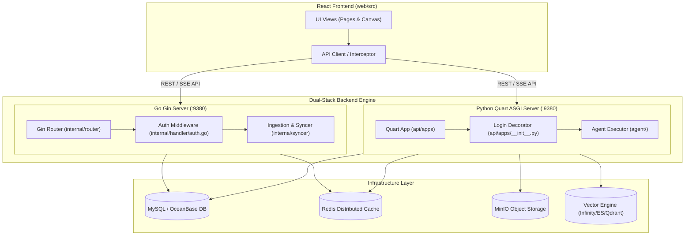

# High-Level Architecture

## Level 1: Subsystem Layers

RAGFlow is organized into six major functional layers:

1. **Presentation Layer (Web Client)**: React 18 frontend SPA built with TypeScript, TailwindCSS, Zustand state management, and React Router v7 ([`web/src/routes.tsx`](file:///home/logan78/Desktop/ragflow/web/src/routes.tsx#L28)).
2. **API & Routing Gateway Layer**:
   - **Go Gin Server** ([`cmd/ragflow_server.go`](file:///home/logan78/Desktop/ragflow/cmd/ragflow_server.go#L81)): Provides high-concurrency API handling, user authentication, tenant management, ingestion task dispatching, search bot APIs, and MCP server endpoints.
   - **Python Quart Server** ([`api/ragflow_server.py`](file:///home/logan78/Desktop/ragflow/api/ragflow_server.py#L90)): Async Python ASGI server handling agent flow executions, chat stream completion, deep document parsing jobs, and ML operations.
3. **Core Business Logic & RAG Engine**:
   - **Agent Engine** ([`agent/`](file:///home/logan78/Desktop/ragflow/agent)): Modular node execution runtime (LLM, Retrieval, Code, Switch, Categorize, Keyword Extract, Message, Rewrite).
   - **RAG Retrieval Engine** ([`rag/`](file:///home/logan78/Desktop/ragflow/rag)): Hybrid search, vector calculation, embedding model integration, cross-encoder re-ranking.
4. **Deep Document Parsing Engine (DeepDoc)**:
   - Vision layout recognition, Table structure recognition (TSR), OCR, layout-aware document chunking ([`deepdoc/`](file:///home/logan78/Desktop/ragflow/deepdoc)).
5. **Persistence & Data Storage Layer**:
   - **Relational DB**: MySQL / OceanBase storing metadata, users, tenants, datasets, documents, chat histories, agent canvas structures.
   - **Distributed Cache / Key-Value Store**: Redis storing user sessions, rate limits, distributed lock keys, execution progress.
   - **Object Storage**: MinIO / S3 storing uploaded raw files, images, generated thumbnails, audio files.
   - **Vector Engine**: Infinity, Elasticsearch, OpenSearch, OceanBase, Qdrant, Milvus, PostgreSQL/PGVector, Tantivy.
6. **Background Ingestion & Execution Workers**:
   - Task sync workers ([`internal/syncer/`](file:///home/logan78/Desktop/ragflow/internal/syncer)), ingestion service ([`internal/ingestion/`](file:///home/logan78/Desktop/ragflow/internal/ingestion)), and task executor threads.

---

## Level 2: Component Interactions & Source Links

### Layer Breakdown Table

| Layer | Primary Responsibilities | Python Implementation | Go Implementation |
| :--- | :--- | :--- | :--- |
| **API / Gateway** | Request parsing, auth validation, CORS, routing | [`api/apps/__init__.py`](file:///home/logan78/Desktop/ragflow/api/apps/__init__.py#L61) | [`internal/router/router.go`](file:///home/logan78/Desktop/ragflow/internal/router/router.go#L141) |
| **User & Tenant** | Users, password hashing, tenant context, API keys | [`api/db/services/user_service.py`](file:///home/logan78/Desktop/ragflow/api/db/services/user_service.py#L33) | [`internal/service/tenant.go`](file:///home/logan78/Desktop/ragflow/internal/service/tenant.go) |
| **Dataset & Doc** | Knowledge base CRUD, document upload, status check | [`api/db/services/document_service.py`](file:///home/logan78/Desktop/ragflow/api/db/services/document_service.py) | [`internal/service/document/`](file:///home/logan78/Desktop/ragflow/internal/service/document) |
| **DeepDoc Engine**| Layout parsing, OCR, table extraction | [`deepdoc/vision/`](file:///home/logan78/Desktop/ragflow/deepdoc/vision) | [`internal/ingestion/`](file:///home/logan78/Desktop/ragflow/internal/ingestion) |
| **Agent Engine**  | Canvas graph execution, node evaluation | [`agent/component/`](file:///home/logan78/Desktop/ragflow/agent/component) | [`internal/agent/canvas/`](file:///home/logan78/Desktop/ragflow/internal/agent/canvas) |
| **DocStore Engine**| Vector & full-text indexing and retrieval | [`common/doc_store/`](file:///home/logan78/Desktop/ragflow/common/doc_store) | [`internal/dao/`](file:///home/logan78/Desktop/ragflow/internal/dao) |

---

## Service Communication Architecture

