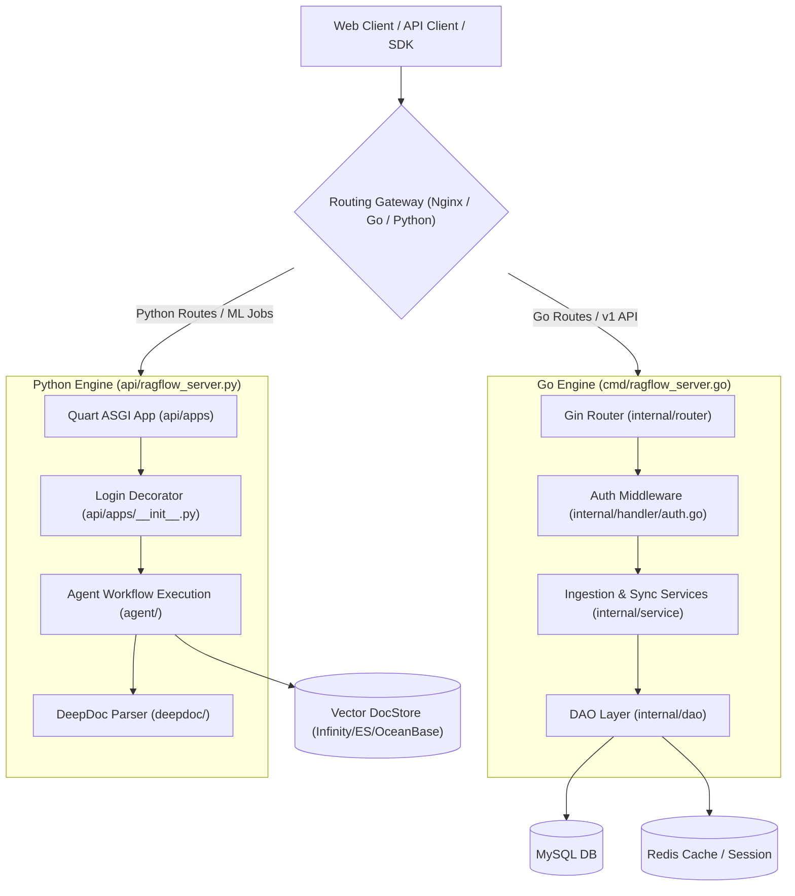

# What is RAGFlow?

## Level 1: Conceptual Explanation

**RAGFlow** is an open-source, enterprise-grade Retrieval-Augmented Generation (RAG) engine designed to ground Large Language Models (LLMs) in deep enterprise knowledge bases. Unlike standard baseline RAG implementations that rely on naive string splitting or basic text extraction, RAGFlow solves the fundamental challenge of **"Garbage In, Garbage Out"** in RAG systems.

### Core Capabilities

1. **Deep Document Parsing (DeepDoc)**:
   Extracts structured knowledge from complex layout documents (PDFs, DOCX, PPTX, Scan images, Tables, Excel sheets, Audio). DeepDoc utilizes vision models for layout analysis, OCR, visual table extraction, and multi-column order reconstruction.

2. **Dual-Stack High Concurrency Engine**:
   Leverages a dual-stack backend architecture where high-frequency API routing, ingestion task syncing, admin services, and MCP servers run on a fast **Go (Gin)** runtime ([`cmd/ragflow_server.go`](file:///home/logan78/Desktop/ragflow/cmd/ragflow_server.go#L81)), while complex machine learning pipelines, LLM invocations, and agent workflows run on **Python (Quart ASGI)** ([`api/ragflow_server.py`](file:///home/logan78/Desktop/ragflow/api/ragflow_server.py#L90)).

3. **Visual Agentic Workflow Canvas**:
   Offers a drag-and-drop workflow canvas built with React and `@xyflow/react` ([`web/src/pages/agent/canvas/index.tsx`](file:///home/logan78/Desktop/ragflow/web/src/pages/agent/canvas/index.tsx)), allowing developers to compose complex multi-node agents (Retrieval, LLM, Code, If-Else, Switch, Iteration, Keyword Extract, Image Generate).

4. **Multi-Vector Hybrid Retrieval & Re-ranking**:
   Integrates vector similarity search (dense embeddings) with BM25 full-text keyword search and cross-encoder re-ranking. Supports pluggable vector engines including Infinity, Elasticsearch, OpenSearch, OceanBase, Qdrant, Milvus, PostgreSQL (PGVector), and Tantivy.

5. **Multi-Tenancy & Enterprise Governance**:
   Includes complete user role management (`owner`, `admin`, `normal`), multi-tenant data isolation (`tenant_id`), session persistence via Redis, API tokens, and Model Context Protocol (MCP) server endpoints.

---

## Level 2: Implementation & Source Architecture

### Primary Component Architecture

### Key Source References

- Python Main Entry: [`api/ragflow_server.py`](file:///home/logan78/Desktop/ragflow/api/ragflow_server.py#L90)
- Python App Registration & Middleware: [`api/apps/__init__.py`](file:///home/logan78/Desktop/ragflow/api/apps/__init__.py#L61)
- Go Engine Main Entry: [`cmd/ragflow_server.go`](file:///home/logan78/Desktop/ragflow/cmd/ragflow_server.go#L81)
- Go Router Config: [`internal/router/router.go`](file:///home/logan78/Desktop/ragflow/internal/router/router.go#L141)
- DeepDoc Vision Pipeline: [`deepdoc/vision/`](file:///home/logan78/Desktop/ragflow/deepdoc/vision)
- Agent Workflow Engine: [`agent/component/`](file:///home/logan78/Desktop/ragflow/agent/component)
- Frontend App Routes: [`web/src/routes.tsx`](file:///home/logan78/Desktop/ragflow/web/src/routes.tsx#L28)
