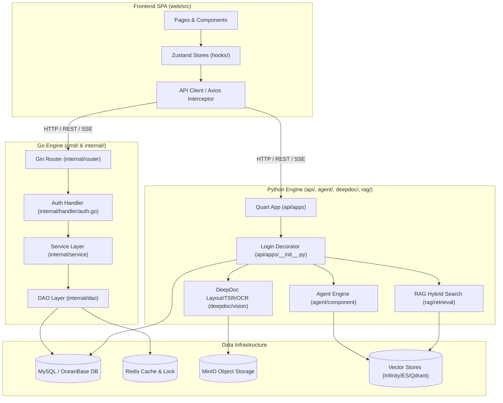

# Module Dependency Map

## Level 1: System Dependency Graph

This document details the dependencies between architectural layers, third-party libraries, storage engines, and internal modules across the RAGFlow monorepo.

---

## Level 2: Inter-Module Dependency Architecture

---

## Module Dependency Matrix

| Requiring Module | Dependent Module | Communication Protocol / Mechanism | Source File References |
| :--- | :--- | :--- | :--- |
| `web/src` | `cmd/ragflow_server.go` | HTTP REST / Bearer Token Auth | [`web/src/routes.tsx`](file:///home/logan78/Desktop/ragflow/web/src/routes.tsx#L28) |
| `web/src` | `api/ragflow_server.py` | HTTP SSE (Server-Sent Events) | [`web/src/pages/agent/canvas/index.tsx`](file:///home/logan78/Desktop/ragflow/web/src/pages/agent/canvas/index.tsx) |
| `internal/handler` | `internal/service` | In-process Go interface calls | [`internal/router/router.go`](file:///home/logan78/Desktop/ragflow/internal/router/router.go#L65) |
| `internal/service` | `internal/dao` | GORM SQL queries | [`internal/dao/user.go`](file:///home/logan78/Desktop/ragflow/internal/dao/user.go) |
| `api/apps/restful_apis` | `api/db/services` | Peewee ORM context calls | [`api/apps/__init__.py`](file:///home/logan78/Desktop/ragflow/api/apps/__init__.py#L128) |
| `agent/component` | `common/doc_store` | Python class instantiation | [`agent/component/retrieval.py`](file:///home/logan78/Desktop/ragflow/agent/component/retrieval.py) |
| `deepdoc/parser` | `deepdoc/vision` | PyTorch inference model execution | [`deepdoc/vision/layout_recognizer.py`](file:///home/logan78/Desktop/ragflow/deepdoc/vision/layout_recognizer.py) |
