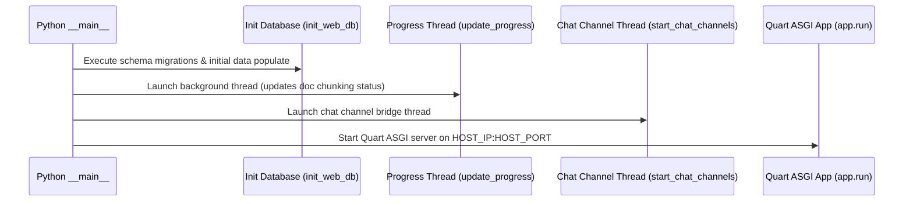

# System Entry Points

## Level 1: Operational Entry Points Overview

RAGFlow provides multiple executable entry points depending on the execution mode (Go HTTP Engine, Python ASGI Engine, Interactive CLI Tool, and Web SPA Frontend).

```
+-----------------------------------------------------------------------------------+
| EXECUTION ENTRY POINTS                                                            |
+-----------------------------------------------------------------------------------+
|  1. Python Server Entry: `python3 api/ragflow_server.py`                           |
|  2. Go Server Entry: `ragflow_server --api --port 9380`                           |
|  3. Go CLI Entry: `ragflow-cli` (Interactive Shell)                              |
|  4. Frontend SPA Entry: `web/src/app.tsx` -> `web/src/routes.tsx`                  |
+-----------------------------------------------------------------------------------+
```

---

## Level 2: Comprehensive Code Execution Analysis

### 1. Python Server Entry Point ([`api/ragflow_server.py`](file:///home/logan78/Desktop/ragflow/api/ragflow_server.py#L90))

#### Command Line Arguments
- `--version`: Prints the current version of RAGFlow ([`common/versions.py`](file:///home/logan78/Desktop/ragflow/common/versions.py)) and exits.
- `--debug`: Runs the server in debug mode with verbose logging.
- `--init-superuser`: Initializes the default admin superuser account in MySQL ([`api/db/init_data.py`](file:///home/logan78/Desktop/ragflow/api/db/init_data.py)).

#### Startup Sequence & Thread Dispatch


- Document Progress Updater Thread ([`api/ragflow_server.py:L56`](file:///home/logan78/Desktop/ragflow/api/ragflow_server.py#L56)): Uses `RedisDistributedLock` to ensure only one instance updates document chunking progress across a cluster.
- Exit Signal Handler ([`api/ragflow_server.py:L83`](file:///home/logan78/Desktop/ragflow/api/ragflow_server.py#L83)): Catches `SIGINT` and `SIGTERM` to close MCP sessions and terminate background threads cleanly.

---

### 2. Go Server Entry Point ([`cmd/ragflow_server.go`](file:///home/logan78/Desktop/ragflow/cmd/ragflow_server.go#L81))

#### Command Line Arguments & Server Modes
- `--api`: Runs as the primary Gin HTTP API backend ([`cmd/ragflow_server.go:L97`](file:///home/logan78/Desktop/ragflow/cmd/ragflow_server.go#L97)).
- `--admin`: Runs as the enterprise administration node.
- `--ingestor`: Runs as a document processing ingestion worker.
- `--syncer`: Runs as a background database and task synchronization daemon.
- `--migrate`: Executes database schema migrations before launch.

#### Gin Setup Code Flow
```go
// cmd/ragflow_server.go
engine := gin.New()
router := router.NewRouter(...)
router.Setup(engine)
```
- Attaches `X-API-Source: go` response header ([`internal/router/router.go:L146`](file:///home/logan78/Desktop/ragflow/internal/router/router.go#L146)).
- Configures health check routes (`/health`, `/system/ping`, `/system/version`).

---

### 3. Go Interactive Terminal CLI Entry Point ([`cmd/ragflow-cli.go`](file:///home/logan78/Desktop/ragflow/cmd/ragflow-cli.go))

Provides a terminal REPL environment for executing commands against RAGFlow:
- User Management commands (`user add`, `user list`, `user delete`).
- System status commands (`system status`, `system ping`).
- Configuration commands.

---

### 4. React Frontend Application Entry Point ([`web/src/app.tsx`](file:///home/logan78/Desktop/ragflow/web/src/app.tsx#L1))

- Initializes React root element (`ReactDOM.createRoot`).
- Wraps app in i18n localization providers (`I18nextProvider`).
- Mounts router defined in [`web/src/routes.tsx`](file:///home/logan78/Desktop/ragflow/web/src/routes.tsx#L28).
