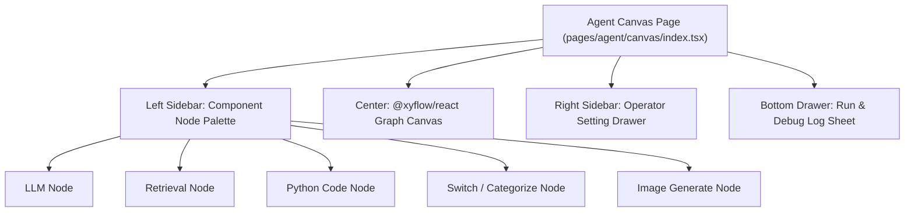

# Agent Canvas UI

## Level 1: Visual Workflow Editor

The Agent Canvas UI ([`web/src/pages/agent/canvas/index.tsx`](file:///home/logan78/Desktop/ragflow/web/src/pages/agent/canvas/index.tsx)) is a drag-and-drop workflow editor built on top of `@xyflow/react` (React Flow v12). It empowers developers to visually assemble, configure, debug, and execute complex agent graphs.

---

## Level 2: Component Architecture & Source Map

### Canvas Node Types & Config Drawers

| Node Name | Visual Canvas Handle | Config Drawer Component | Functional Capabilities |
| :--- | :--- | :--- | :--- |
| **LLM Node** | `Begin` / `LLM` | [`pages/agent/form/llm-form/`](file:///home/logan78/Desktop/ragflow/web/src/pages/agent/form) | Model selection, system prompt template, temperature settings. |
| **Retrieval Node** | `Retrieval` | [`pages/agent/form/retrieval-form/`](file:///home/logan78/Desktop/ragflow/web/src/pages/agent/form) | Knowledge base selector, vector similarity threshold, top_k count. |
| **Code Node** | `Code` | [`pages/agent/form/code-form/`](file:///home/logan78/Desktop/ragflow/web/src/pages/agent/form) | Embedded Python code editor for custom data transformation. |
| **Switch Node** | `Switch` | [`pages/agent/form/switch-form/`](file:///home/logan78/Desktop/ragflow/web/src/pages/agent/form) | If-Else / Switch condition expression evaluator. |
| **Categorize Node**| `Categorize` | [`pages/agent/form/categorize-form/`](file:///home/logan78/Desktop/ragflow/web/src/pages/agent/form) | Intent classification rules. |

### Source Links

- Canvas Main Component: [`web/src/pages/agent/canvas/index.tsx`](file:///home/logan78/Desktop/ragflow/web/src/pages/agent/canvas/index.tsx)
- Canvas Node Forms: [`web/src/pages/agent/form/`](file:///home/logan78/Desktop/ragflow/web/src/pages/agent/form)
- Run & Debug Log Sheet: [`web/src/pages/agent/pipeline-run-sheet/`](file:///home/logan78/Desktop/ragflow/web/src/pages/agent/pipeline-run-sheet)
- Agent Hook: [`web/src/hooks/use-agent-request.ts`](file:///home/logan78/Desktop/ragflow/web/src/hooks/use-agent-request.ts)
