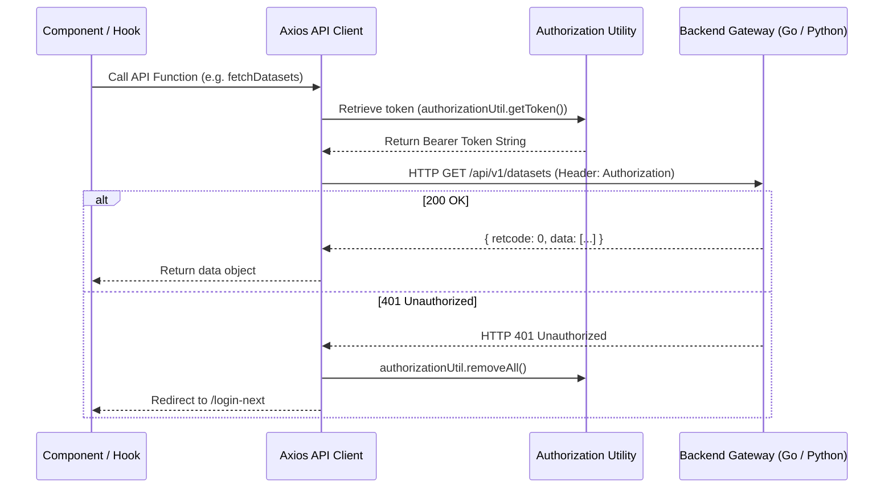

# API Client Architecture

## Level 1: HTTP Client & Interceptor Mechanics

The RAGFlow frontend relies on an Axios-based HTTP client wrapper located in [`web/src/utils/authorization-util.ts`](file:///home/logan78/Desktop/ragflow/web/src/utils/authorization-util.ts) and [`web/src/services/`](file:///home/logan78/Desktop/ragflow/web/src/services).

### Key Responsibilities

1. **Token Injection**: Automatically injects `Authorization: Bearer <access_token>` header into every outgoing HTTP request if a valid token exists in `localStorage`.
2. **Standardized Response Unwrapping**: Unwraps JSON responses structured as `{ retcode: 0, retmsg: "success", data: ... }`. Non-zero `retcode` values trigger error notifications.
3. **Session Invalidation Interceptor**: Upon receiving HTTP 401 Unauthorized, the response interceptor automatically removes the invalid access token, purges session cache, and redirects the user to `/login-next`.
4. **Server-Sent Events (SSE) Streaming**: For chat completion and agent execution nodes, the API client establishes SSE streams using `fetchEventSource` or native `EventSource`, streaming tokens directly into the UI state.

---

## Level 2: Interceptor Sequence & Code Reference

### Core Source Links

- Authorization Interceptor: [`web/src/utils/authorization-util.ts`](file:///home/logan78/Desktop/ragflow/web/src/utils/authorization-util.ts)
- Base API Service Wrappers: [`web/src/services/`](file:///home/logan78/Desktop/ragflow/web/src/services)
- SSE Streaming Handler Hook: [`web/src/hooks/use-send-message.ts`](file:///home/logan78/Desktop/ragflow/web/src/hooks/use-send-message.ts)
- Chat API Service: [`web/src/hooks/use-chat-request.ts`](file:///home/logan78/Desktop/ragflow/web/src/hooks/use-chat-request.ts)
