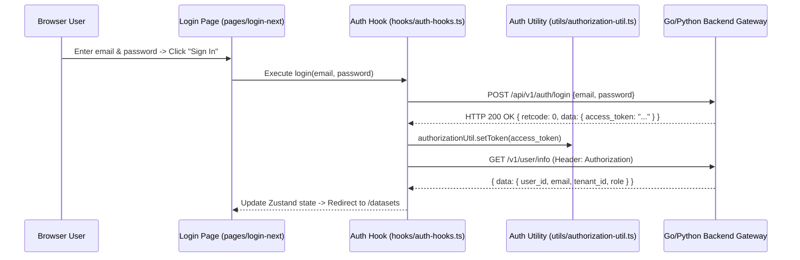

# Frontend Authentication Flow

## Level 1: Auth Architecture & Session Lifecycle

The RAGFlow web frontend supports multiple authentication mechanisms:

1. **Email & Password Authentication**: Standard form login `/auth/login` and registration `/users`.
2. **Third-Party OAuth2 / OIDC**: Single-Click login with GitHub, Google, or Enterprise OpenID Connect (OIDC).
3. **Session & Local Token Persistence**: Upon successful authentication, the server returns an access token which is stored in browser `localStorage` under `ragflow_token`.
4. **Session Recovery**: On page refresh, [`web/src/hooks/auth-hooks.ts`](file:///home/logan78/Desktop/ragflow/web/src/hooks/auth-hooks.ts) fires `fetchUserInfo()` to validate the session and fetch user/tenant profile data.

---

## Level 2: Execution Call Chain & Source Links

### Source File Map

- Login/Register Page Component: [`web/src/pages/login-next/index.tsx`](file:///home/logan78/Desktop/ragflow/web/src/pages/login-next)
- Authentication Custom Hook: [`web/src/hooks/auth-hooks.ts`](file:///home/logan78/Desktop/ragflow/web/src/hooks/auth-hooks.ts)
- Login API Request Handler: [`web/src/hooks/use-login-request.ts`](file:///home/logan78/Desktop/ragflow/web/src/hooks/use-login-request.ts)
- Token Storage & Cookie Utility: [`web/src/utils/authorization-util.ts`](file:///home/logan78/Desktop/ragflow/web/src/utils/authorization-util.ts)
