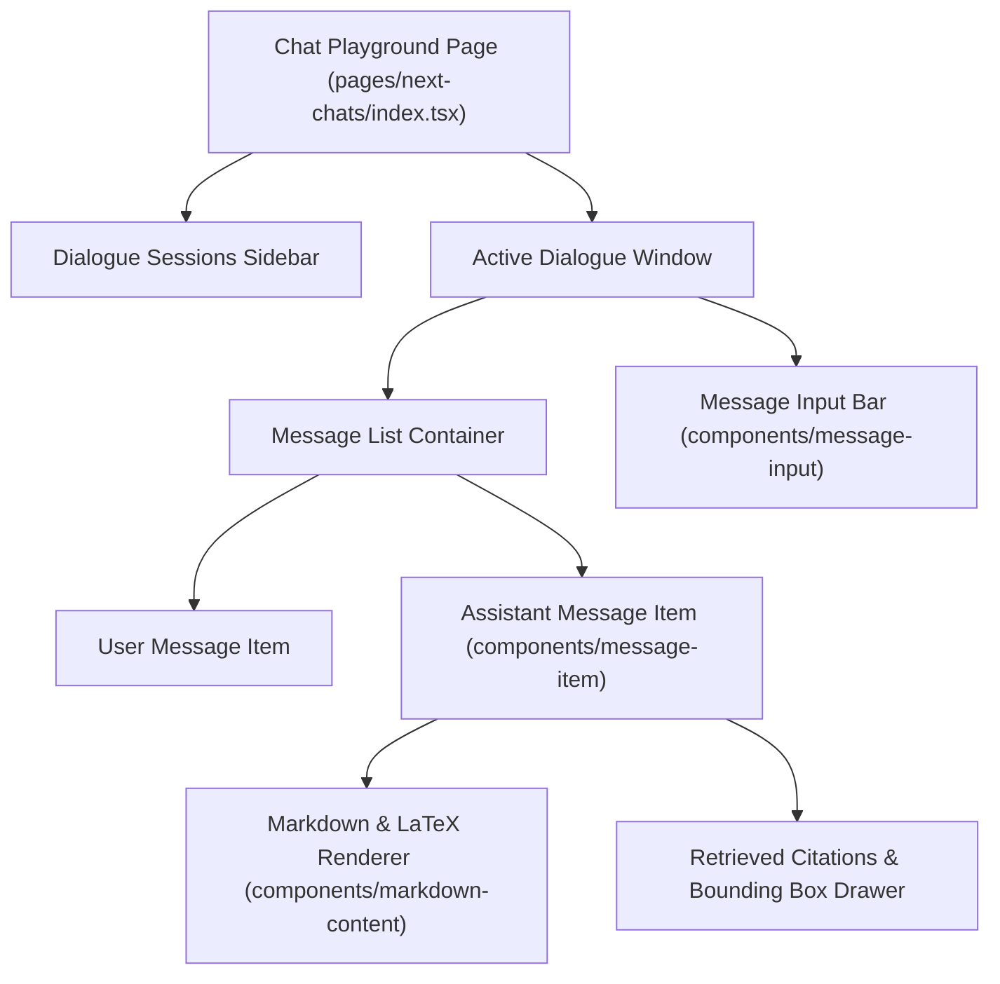

# Chat UI Playground

## Level 1: Interactive Chat Experience

The Chat UI Playground ([`web/src/pages/next-chats/`](file:///home/logan78/Desktop/ragflow/web/src/pages/next-chats)) provides a multi-session conversational interface with Large Language Models grounded in knowledge base datasets.

---

## Level 2: Component Architecture & Source Links

### Key UI Features & Code Mapping

1. **Server-Sent Events (SSE) Stream Handling**: Real-time token streaming from `/v1/api/chat/completion` handled via custom hook [`web/src/hooks/use-send-message.ts`](file:///home/logan78/Desktop/ragflow/web/src/hooks/use-send-message.ts).
2. **Markdown & Formula Rendering**: Markdown parsed via [`web/src/components/markdown-content`](file:///home/logan78/Desktop/ragflow/web/src/components/markdown-content) supporting code blocks, syntax highlighting, and KaTeX mathematical notation.
3. **Citations & Chunk Highlighting**: Assistant responses include interactive citation pills linking directly to original PDF bounding boxes or chunk text.
4. **Public Chat Sharing & Widgets**: Standalone chat embedding widget defined in [`web/src/pages/next-chats/share/index.tsx`](file:///home/logan78/Desktop/ragflow/web/src/pages/next-chats/share).

### Source Links

- Chat Page Entry: [`web/src/pages/next-chats/index.tsx`](file:///home/logan78/Desktop/ragflow/web/src/pages/next-chats)
- Public Shared Chat: [`web/src/pages/next-chats/share/index.tsx`](file:///home/logan78/Desktop/ragflow/web/src/pages/next-chats/share)
- Message Item Component: [`web/src/components/message-item/index.tsx`](file:///home/logan78/Desktop/ragflow/web/src/components/message-item)
- Chat Request Hook: [`web/src/hooks/use-chat-request.ts`](file:///home/logan78/Desktop/ragflow/web/src/hooks/use-chat-request.ts)
