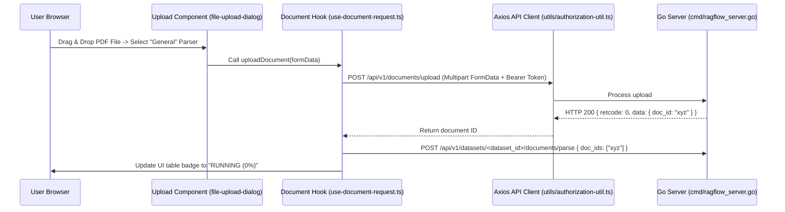
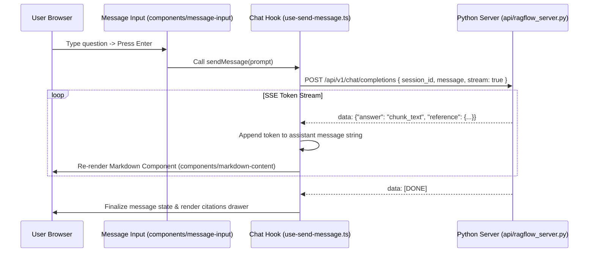

# Frontend Data Flow

## Level 1: End-to-End User Interaction Flow

This document details the lifecycle of data moving through the frontend single-page application—from raw user input down through React components, Zustand state stores, Axios API wrappers, Server-Sent Events (SSE) channels, and back into rendered DOM elements.

---

## Level 2: Comprehensive Interaction Sequence Diagrams

### 1. Document Upload & Chunking Flow

### 2. Real-Time Chat SSE Stream Flow

### Key Source References

- Document Request Hook: [`web/src/hooks/use-document-request.ts`](file:///home/logan78/Desktop/ragflow/web/src/hooks/use-document-request.ts)
- SSE Send Message Hook: [`web/src/hooks/use-send-message.ts`](file:///home/logan78/Desktop/ragflow/web/src/hooks/use-send-message.ts)
- Authorization Utility: [`web/src/utils/authorization-util.ts`](file:///home/logan78/Desktop/ragflow/web/src/utils/authorization-util.ts)
- Markdown Component: [`web/src/components/markdown-content/index.tsx`](file:///home/logan78/Desktop/ragflow/web/src/components/markdown-content)
