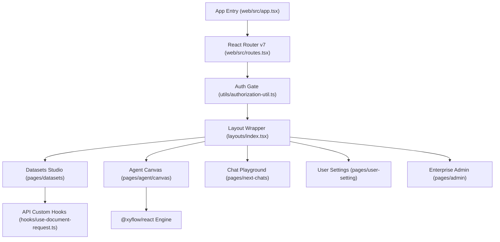

# Frontend Overview

## Level 1: Design Philosophy & User Experience

The RAGFlow Web Frontend is an enterprise-grade Single-Page Application (SPA) designed for operational efficiency, rapid visual workflow creation, deep knowledge base management, real-time chat testing, and multi-tenant administration.

### Primary UI Pillars

1. **Knowledge Base (Dataset) Studio**: Interface for creating datasets, uploading multi-format files, configuring parser options (General, Q&A, Paper, Manual, Law, Table, Book, Audio, Visual), previewing parsed chunks, and testing retrieval accuracy.
2. **Visual Agent Canvas Builder**: Drag-and-drop workflow builder powered by `@xyflow/react` ([`web/src/pages/agent/canvas/index.tsx`](file:///home/logan78/Desktop/ragflow/web/src/pages/agent/canvas/index.tsx)), enabling users to wire LLMs, retrieval engines, custom Python code nodes, conditional switches, and image generation components.
3. **Chat & Search Playground**: Multi-modal chat interface with real-time token streaming via Server-Sent Events (SSE), citations drawer, image popovers, and LaTeX/code syntax highlighting.
4. **Tenant & Model Configuration**: Management dashboard for API keys, system team management, LLM provider credentials (OpenAI, DeepSeek, Ollama, Qwen, HuggingFace), and sandbox parameters.

---

## Level 2: Component Architecture & Source Structure

### Core Source Links

- Entry Point: [`web/src/app.tsx`](file:///home/logan78/Desktop/ragflow/web/src/app.tsx#L1)
- Route Definitions: [`web/src/routes.tsx`](file:///home/logan78/Desktop/ragflow/web/src/routes.tsx#L28)
- Authorization Utility: [`web/src/utils/authorization-util.ts`](file:///home/logan78/Desktop/ragflow/web/src/utils/authorization-util.ts)
- Main Component Library: [`web/src/components/`](file:///home/logan78/Desktop/ragflow/web/src/components)
- Custom Hooks: [`web/src/hooks/`](file:///home/logan78/Desktop/ragflow/web/src/hooks)
