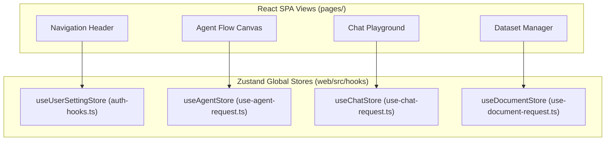

# State Management

## Level 1: Multi-Tier State Strategy

RAGFlow frontend uses a tiered state management approach:

1. **Global Store State (Zustand)**: Persistent application state (user profile, authentication tokens, global language, dark/light theme, active dataset settings, active model credentials).
2. **Server Async State (Custom React Hooks)**: Asynchronous server state fetching, caching, invalidation, and background polling ([`web/src/hooks/`](file:///home/logan78/Desktop/ragflow/web/src/hooks)).
3. **Local Component State (React Hooks)**: Transient UI states (modal open/closed, form validation error strings, active tabs).
4. **URL Search Parameter State (React Router)**: Search filters, active page index, view mode toggles preserved across browser refreshes.

---

## Level 2: Zustand Stores & Hook Implementations

### Store Reference Table

| Store / Hook File | State Scope | State Variables & Actions | Source Link |
| :--- | :--- | :--- | :--- |
| [`auth-hooks.ts`](file:///home/logan78/Desktop/ragflow/web/src/hooks/auth-hooks.ts) | User Auth & Profile | `userInfo`, `tenantInfo`, `login()`, `logout()`, `fetchUserInfo()` | [`auth-hooks.ts`](file:///home/logan78/Desktop/ragflow/web/src/hooks/auth-hooks.ts) |
| [`use-agent-request.ts`](file:///home/logan78/Desktop/ragflow/web/src/hooks/use-agent-request.ts) | Canvas State | `nodes`, `edges`, `addNode()`, `updateNodeForm()`, `runCanvas()` | [`use-agent-request.ts`](file:///home/logan78/Desktop/ragflow/web/src/hooks/use-agent-request.ts) |
| [`use-chat-request.ts`](file:///home/logan78/Desktop/ragflow/web/src/hooks/use-chat-request.ts) | Chat & Stream | `currentSession`, `messages`, `sendMessage()`, `stopStream()` | [`use-chat-request.ts`](file:///home/logan78/Desktop/ragflow/web/src/hooks/use-chat-request.ts) |
| [`use-document-request.ts`](file:///home/logan78/Desktop/ragflow/web/src/hooks/use-document-request.ts) | Document & Chunk | `documentList`, `chunkList`, `uploadDocument()`, `changeChunkStatus()` | [`use-document-request.ts`](file:///home/logan78/Desktop/ragflow/web/src/hooks/use-document-request.ts) |
| [`use-knowledge-request.ts`](file:///home/logan78/Desktop/ragflow/web/src/hooks/use-knowledge-request.ts) | Dataset Management | `kbList`, `currentKb`, `createKnowledgeBase()`, `deleteKb()` | [`use-knowledge-request.ts`](file:///home/logan78/Desktop/ragflow/web/src/hooks/use-knowledge-request.ts) |
