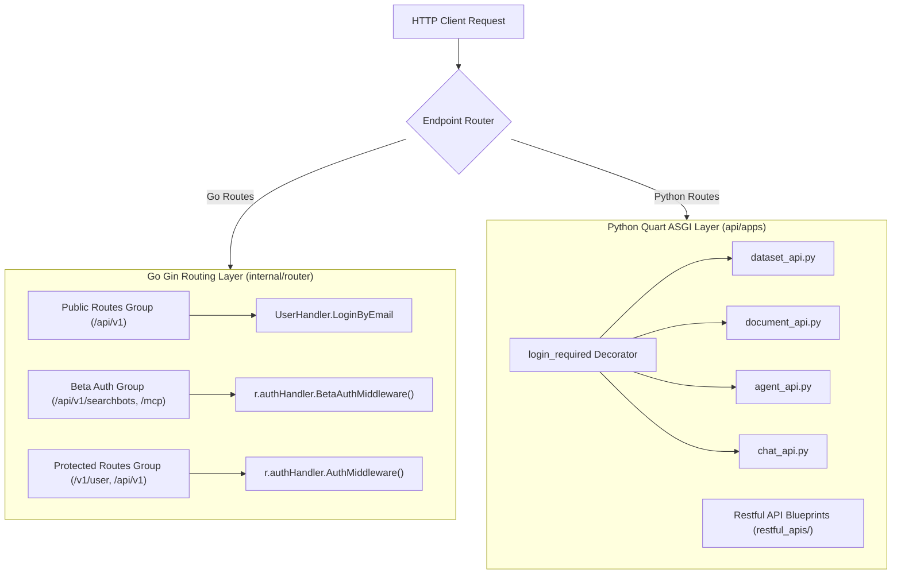

# Backend API Layer

## Level 1: HTTP API Dispatch Architecture

The API layer is responsible for parsing HTTP requests, enforcing CORS headers, executing authentication decorators, validating JSON payloads, invoking service logic, and serializing JSON or SSE stream responses.

---

## Level 2: Dual Routing Dispatch Comparison

### Route & Auth Handler Matrix

| Path Prefix | Engine | Auth Mechanism | Primary Handler File |
| :--- | :--- | :--- | :--- |
| `/health`, `/system/ping` | Go | None | [`internal/handler/system.go`](file:///home/logan78/Desktop/ragflow/internal/handler/system.go) |
| `/api/v1/auth/login` | Go | None | [`internal/handler/user.go`](file:///home/logan78/Desktop/ragflow/internal/handler/user.go) |
| `/api/v1/mcp` | Go | Beta Auth | [`internal/handler/mcp_server.go`](file:///home/logan78/Desktop/ragflow/internal/handler/mcp_server.go) |
| `/v1/user/info` | Go | JWT / AuthMiddleware | [`internal/handler/user.go`](file:///home/logan78/Desktop/ragflow/internal/handler/user.go) |
| `/api/v1/datasets` | Python | `login_required` | [`api/apps/restful_apis/dataset_api.py`](file:///home/logan78/Desktop/ragflow/api/apps/restful_apis/dataset_api.py) |
| `/api/v1/documents` | Python | `login_required` | [`api/apps/restful_apis/document_api.py`](file:///home/logan78/Desktop/ragflow/api/apps/restful_apis/document_api.py) |
| `/api/v1/agents` | Python | `login_required` | [`api/apps/restful_apis/agent_api.py`](file:///home/logan78/Desktop/ragflow/api/apps/restful_apis/agent_api.py) |
| `/api/v1/chats` | Python | `login_required` | [`api/apps/restful_apis/chat_api.py`](file:///home/logan78/Desktop/ragflow/api/apps/restful_apis/chat_api.py) |

### Key Source Links

- Go Router Setup: [`internal/router/router.go`](file:///home/logan78/Desktop/ragflow/internal/router/router.go#L141)
- Python App Initialization: [`api/apps/__init__.py`](file:///home/logan78/Desktop/ragflow/api/apps/__init__.py#L61)
- Python Restful API Folder: [`api/apps/restful_apis/`](file:///home/logan78/Desktop/ragflow/api/apps/restful_apis)
- Go Handlers Folder: [`internal/handler/`](file:///home/logan78/Desktop/ragflow/internal/handler)
