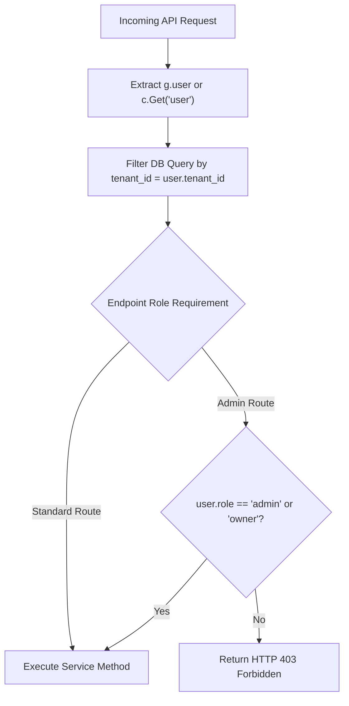

# Backend Authorization & Access Control

## Level 1: Role-Based & Multi-Tenant Authorization

RAGFlow implements a dual-tier authorization model:

1. **Role-Based Access Control (RBAC)**: Users are assigned system roles:
   - `owner`: Primary account owner with full organization and workspace controls.
   - `admin`: Enterprise administrator capable of managing users, tenant settings, and system parameters.
   - `normal`: Standard workspace member with read/write access to assigned datasets, chats, and canvas graphs.
2. **Tenant Data Boundary Enforcement**: All database queries for datasets, documents, tasks, dialogues, and canvas workflows enforce tenant isolation via mandatory `tenant_id` filtering.

---

## Level 2: Authorization Checks in Code



### Authorization Code Implementation Examples

#### 1. Tenant Data Filtering in Python Services
```python
# KnowledgebaseService query example
Knowledgebase.select().where(
    Knowledgebase.tenant_id == current_user.tenant_id,
    Knowledgebase.status == StatusEnum.VALID.value
)
```

#### 2. Tenant Data Filtering in Go DAOs ([`internal/dao/tenant.go`](file:///home/logan78/Desktop/ragflow/internal/dao/tenant.go))
```go
db.Where("tenant_id = ? AND status = ?", tenantID, status)
```

### Key Source References

- User Tenant Role Definitions: [`api/db/db_models.py`](file:///home/logan78/Desktop/ragflow/api/db/db_models.py)
- User Service Authorization: [`api/db/services/user_service.py`](file:///home/logan78/Desktop/ragflow/api/db/services/user_service.py#L33)
- Go Tenant DAO: [`internal/dao/tenant.go`](file:///home/logan78/Desktop/ragflow/internal/dao/tenant.go)
- Go Tenant Handler: [`internal/handler/tenant.go`](file:///home/logan78/Desktop/ragflow/internal/handler/tenant.go)
