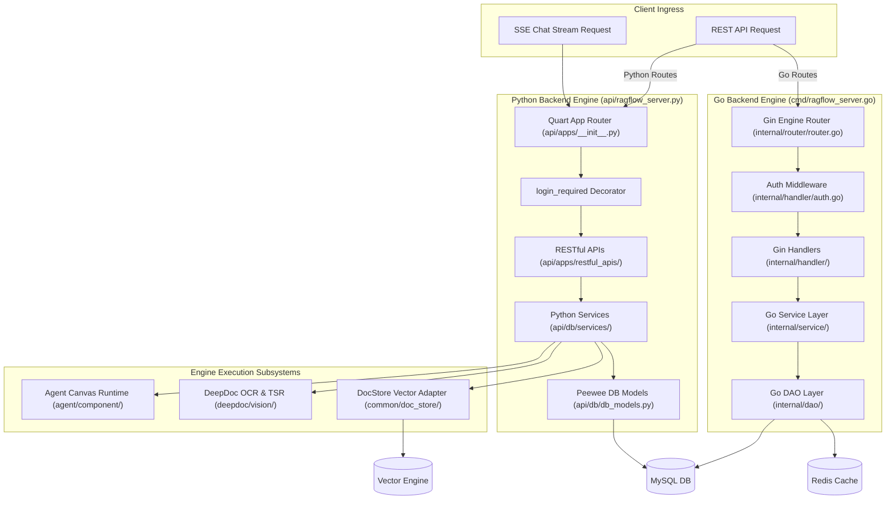

# Backend System Architecture

## Level 1: Architectural Patterns

The RAGFlow backend is architected around four core software design patterns:

1. **Dual-Stack Gateway Strategy**: Requests entering the system pass through Nginx to either the Go Gin server (for user/tenant/auth/sync handlers) or the Python Quart server (for heavy ML/agent execution). The Go server attaches `X-API-Source: go` to HTTP responses ([`internal/router/router.go:L146`](file:///home/logan78/Desktop/ragflow/internal/router/router.go#L146)).
2. **Layered Service-DAO Pattern**: Clean isolation between the Handler/Controller layer (`api/apps/restful_apis/` or `internal/handler/`), Service layer (`api/db/services/` or `internal/service/`), and Data Access Object (DAO) layer (`api/db/db_models.py` or `internal/dao/`).
3. **Distributed Lock Coordination**: Background document chunking status updaters and task ingestion queues synchronize using Redis distributed locks (`RedisDistributedLock`) ([`api/ragflow_server.py:L56`](file:///home/logan78/Desktop/ragflow/api/ragflow_server.py#L56)).
4. **Pluggable Vector Storage Abstraction**: Vector database interactions pass through a unified DocStore interface ([`common/doc_store/`](file:///home/logan78/Desktop/ragflow/common/doc_store)), decoupling business logic from underlying search engines (Infinity, ES, OceanBase, Qdrant, Milvus).

---

## Level 2: Detailed Architectural Diagrams & Code Map

### Primary Code References

- Go Main Entry: [`cmd/ragflow_server.go`](file:///home/logan78/Desktop/ragflow/cmd/ragflow_server.go#L81)
- Go Router: [`internal/router/router.go`](file:///home/logan78/Desktop/ragflow/internal/router/router.go#L141)
- Python Server Entry: [`api/ragflow_server.py`](file:///home/logan78/Desktop/ragflow/api/ragflow_server.py#L90)
- Python App Setup: [`api/apps/__init__.py`](file:///home/logan78/Desktop/ragflow/api/apps/__init__.py#L61)
- Database Models: [`api/db/db_models.py`](file:///home/logan78/Desktop/ragflow/api/db/db_models.py)
- DocStore Interface: [`common/doc_store/`](file:///home/logan78/Desktop/ragflow/common/doc_store)
