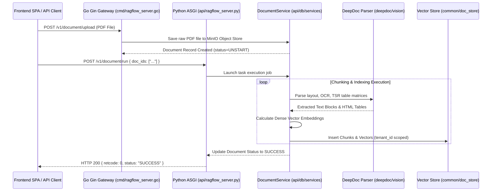
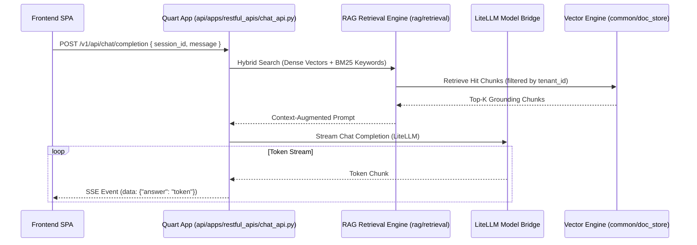

# Backend Data Flow Architecture

## Level 1: End-to-End Data Processing Pipeline

This document details how data flows through the backend system, from HTTP request entry to database transaction execution, vector store indexing, and response rendering.

---

## Level 2: Comprehensive Execution Sequence Diagrams

### 1. Document Chunking & Indexing Flow

### 2. Conversational RAG Chat Stream Flow

### Key Source Links

- Document Upload Handler: [`internal/handler/document.go`](file:///home/logan78/Desktop/ragflow/internal/handler/document.go)
- Document Service: [`api/db/services/document_service.py`](file:///home/logan78/Desktop/ragflow/api/db/services/document_service.py)
- Chat REST API: [`api/apps/restful_apis/chat_api.py`](file:///home/logan78/Desktop/ragflow/api/apps/restful_apis/chat_api.py)
- RAG Retrieval Engine: [`rag/retrieval/`](file:///home/logan78/Desktop/ragflow/rag)
- DocStore Connector: [`common/doc_store/`](file:///home/logan78/Desktop/ragflow/common/doc_store)
