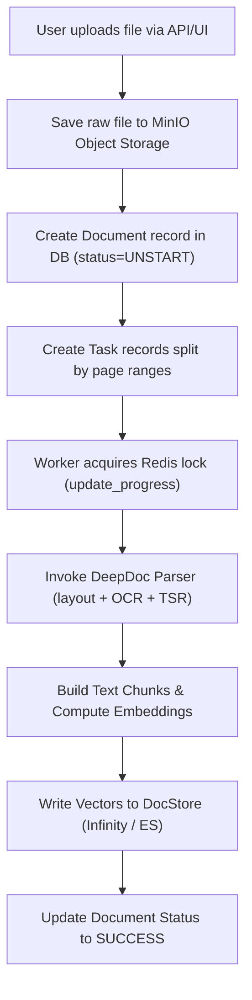

# Domain Business Logic

## Level 1: Core Business Domain Overview

RAGFlow encapsulates four major business logic domains:

1. **Multi-Tenant User & Access Governance**: Enforces organization tenant boundaries, user roles (`owner`, `admin`, `normal`), API tokens (`APIToken`), and tenant-isolated LLM provider credentials.
2. **Deep Document Processing & Chunking Execution**: Controls document upload, type-specific layout parsing, visual table extraction (TSR), chunk generation, and docstore indexing.
3. **Agentic Canvas Graph Execution Engine**: Evaluates node graph topologies created in the visual canvas, managing data flow between LLM, Retrieval, Code, Switch, and Tool nodes.
4. **Hybrid Retrieval & Reranking Subsystem**: Integrates dense vector search with sparse BM25 keyword matching and cross-encoder re-ranking models.

---

## Level 2: Domain Implementation Details & Source Links

### 1. Document Parsing & Chunking Dispatch ([`api/db/services/document_service.py`](file:///home/logan78/Desktop/ragflow/api/db/services/document_service.py))

### 2. Agent Workflow Graph Engine ([`agent/component/`](file:///home/logan78/Desktop/ragflow/agent/component))

- Graph evaluation is driven by node input/output wiring defined in the canvas JSON schema.
- **LLM Node** ([`agent/component/llm.py`](file:///home/logan78/Desktop/ragflow/agent/component/llm.py)): Generates prompts, calls LiteLLM, handles token streaming.

### 3. Hybrid RAG Search Logic ([`rag/nlp/`](file:///home/logan78/Desktop/ragflow/rag))

- Vector search computes Cosine / L2 distance across dense vector embeddings.
- Full-text BM25 search queries term inverted indexes.
- Fusion module merges results using Reciprocal Rank Fusion (RRF) or Cross-Encoder re-ranker scores.

### Source References

- Document Service: [`api/db/services/document_service.py`](file:///home/logan78/Desktop/ragflow/api/db/services/document_service.py)
- Task Service: [`api/db/services/task_service.py`](file:///home/logan78/Desktop/ragflow/api/db/services/task_service.py)
- Agent Node Components: [`agent/component/`](file:///home/logan78/Desktop/ragflow/agent/component)
- DeepDoc Vision Pipeline: [`deepdoc/vision/`](file:///home/logan78/Desktop/ragflow/deepdoc/vision)
- Hybrid Retrieval Engine: [`rag/nlp/`](file:///home/logan78/Desktop/ragflow/rag)
