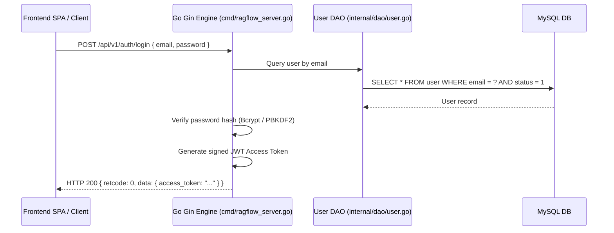
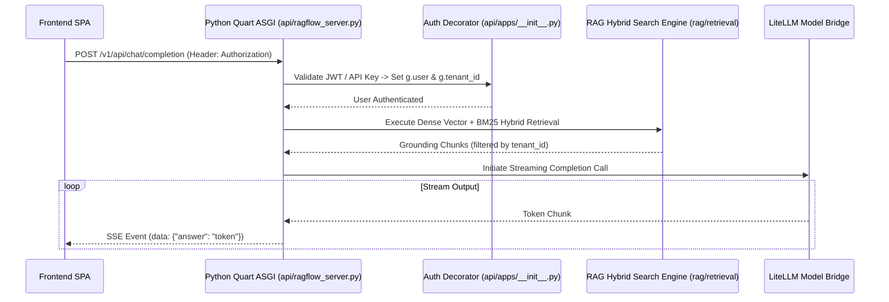

# End-to-End API Call Flow

## Level 1: System Call Sequence

This document details end-to-end API request lifecycles across the Go Gin gateway and Python Quart ASGI application.

---

## Level 2: Comprehensive Sequence Diagrams

### 1. User Authentication & JWT Issuance Call Flow

### 2. Conversational RAG SSE Stream Call Flow

### Key Source Links

- Go Router Setup: [`internal/router/router.go`](file:///home/logan78/Desktop/ragflow/internal/router/router.go#L141)
- Python Auth Decorator: [`api/apps/__init__.py`](file:///home/logan78/Desktop/ragflow/api/apps/__init__.py#L98-L220)
- Python Chat REST Endpoint: [`api/apps/restful_apis/chat_api.py`](file:///home/logan78/Desktop/ragflow/api/apps/restful_apis/chat_api.py)
- Go User Handler: [`internal/handler/user.go`](file:///home/logan78/Desktop/ragflow/internal/handler/user.go)
