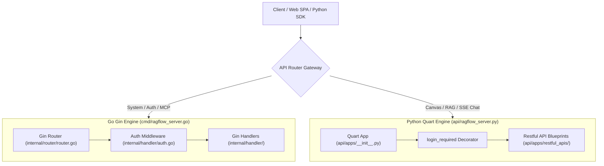

# REST API Layer Overview

## Level 1: Conceptual Overview & Protocol Design

The RAGFlow REST API layer exposes multi-tenant interfaces for client applications, web SPAs, SDKs, and Model Context Protocol (MCP) clients.

### Key API Design Rules

1. **Dual Routing Gateways**:
   - Go Gin Engine ([`internal/router/router.go`](file:///home/logan78/Desktop/ragflow/internal/router/router.go#L141)): Serves user login, system config, search bots, MCP server endpoints, and document ingestion APIs. Responses contain header `X-API-Source: go`.
   - Python Quart Engine ([`api/apps/restful_apis/`](file:///home/logan78/Desktop/ragflow/api/apps/restful_apis)): Serves legacy RAG endpoints, agent canvas flows, chat completion streams (SSE), and deep document parsing endpoints.
2. **Version Prefixing**: Standard endpoints use prefix `/api/v1` or `/v1`.
3. **Standardized Response Envelope**: All JSON responses use a standard structure:
   ```json
   {
     "retcode": 0,
     "retmsg": "success",
     "data": {}
   }
   ```
4. **Authentication Headers**: Requires `Authorization: Bearer <token>` or API Key header. Public bot routes use beta SDK tokens (`AUTH_BETA`).

---

## Level 2: API Architecture & Source Code Links



### Core Source Links

- Go Router Setup: [`internal/router/router.go`](file:///home/logan78/Desktop/ragflow/internal/router/router.go#L141)
- Python Restful APIs Folder: [`api/apps/restful_apis/`](file:///home/logan78/Desktop/ragflow/api/apps/restful_apis)
- Response Envelope Utility: [`api/utils/api_utils.py`](file:///home/logan78/Desktop/ragflow/api/utils/api_utils.py)
- OpenAPI Schema Generator: `QuartSchema(app)` in [`api/apps/__init__.py:L65`](file:///home/logan78/Desktop/ragflow/api/apps/__init__.py#L65)
