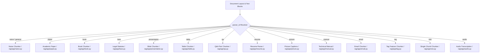

# Domain Chunking Subsystem

## Level 1: Conceptual Overview

Chunking in RAGFlow is domain-aware. Rather than blindly splitting text at fixed token intervals, RAGFlow provides 14 specialized chunkers configured per dataset (`parser_id`), ensuring semantic boundaries (chapters, legal articles, academic paper sections, table rows, slides) are preserved.

---

## Level 2: Implementation Details

### Catalog of Chunking Methods

| Parser ID | Python File Path | Key Logic & Token Boundary Rules |
| :--- | :--- | :--- |
| **`naive` / `general`** | [rag/app/naive.py](file:///home/logan78/Desktop/ragflow/rag/app/naive.py#L30) | Standard sliding token window with overlap. Respects paragraph delimiters (`\n\n`) and max token capacity (default 512). |
| **`paper`** | [rag/app/paper.py](file:///home/logan78/Desktop/ragflow/rag/app/paper.py#L25) | Extracts paper sections (Abstract, Introduction, Method, Experiment, Conclusion, References). Filters out headers/footers. |
| **`book`** | [rag/app/book.py](file:///home/logan78/Desktop/ragflow/rag/app/book.py#L25) | Hierarchy-aware chapter and section splitter based on Markdown headers (`#`, `##`, `###`) or TOC depth. |
| **`laws`** | [rag/app/laws.py](file:///home/logan78/Desktop/ragflow/rag/app/laws.py#L25) | Legal statute parsing, identifying Chapter (章), Section (节), Article (条), Item (款/项). |
| **`presentation`** | [rag/app/presentation.py](file:///home/logan78/Desktop/ragflow/rag/app/presentation.py#L20) | Groups text and figures by PPT page index, appending slide titles to each generated chunk. |
| **`table`** | [rag/app/table.py](file:///home/logan78/Desktop/ragflow/rag/app/table.py#L20) | Processes HTML/Excel tables. Prefixes table title/context to each row chunk to preserve columnar semantics. |
| **`qa`** | [rag/app/qa.py](file:///home/logan78/Desktop/ragflow/rag/app/qa.py#L25) | Parses Question-Answer pairs from Excel/CSV/Text. Stores Question in `question_tks` field for boosted matching. |
| **`resume`** | [rag/app/resume.py](file:///home/logan78/Desktop/ragflow/rag/app/resume.py#L30) | Extracts structured CV entities: Name, Contact, Work History, Education, Skills, using regex & NLP heuristics. |
| **`picture`** | [rag/app/picture.py](file:///home/logan78/Desktop/ragflow/rag/app/picture.py#L20) | Extracts embedded images, generates visual descriptions using VLM (`GptV4` / Vision LLM), and indexes descriptions. |
| **`manual`** | [rag/app/manual.py](file:///home/logan78/Desktop/ragflow/rag/app/manual.py#L20) | Technical specification parser. Groups code blocks, parameter tables, and subsection diagrams. |
| **`email`** | [rag/app/email.py](file:///home/logan78/Desktop/ragflow/rag/app/email.py#L20) | Parses `.eml` / email text into From, To, Subject, Date, and Body sections. |
| **`tag`** | [rag/app/tag.py](file:///home/logan78/Desktop/ragflow/rag/app/tag.py#L20) | Auto-extracts metadata tag features (`tag_fea`) and assigns tag weights (`TAG_FLD`). |
| **`one`** | [rag/app/one.py](file:///home/logan78/Desktop/ragflow/rag/app/one.py#L15) | Stores entire document as single chunk for short docs or small context windows. |
| **`audio`** | [rag/app/audio.py](file:///home/logan78/Desktop/ragflow/rag/app/audio.py#L20) | Converts audio timestamps and ASR transcripts into segmented chunks. |

### Go Chunking Implementation
Go engine mirror implementation lives in [internal/ingestion/component/chunker/](file:///home/logan78/Desktop/ragflow/internal/ingestion/component/chunker/):
- `naive.go` / `one.go`: [one.go](file:///home/logan78/Desktop/ragflow/internal/ingestion/component/chunker/one.go#L20)
- `qa.go`: [qa.go](file:///home/logan78/Desktop/ragflow/internal/ingestion/component/chunker/qa.go#L20)
- `table.go`: [table.go](file:///home/logan78/Desktop/ragflow/internal/ingestion/component/chunker/table.go#L20)
- `presentation.go`: [presentation.go](file:///home/logan78/Desktop/ragflow/internal/ingestion/component/chunker/presentation.go#L20)
