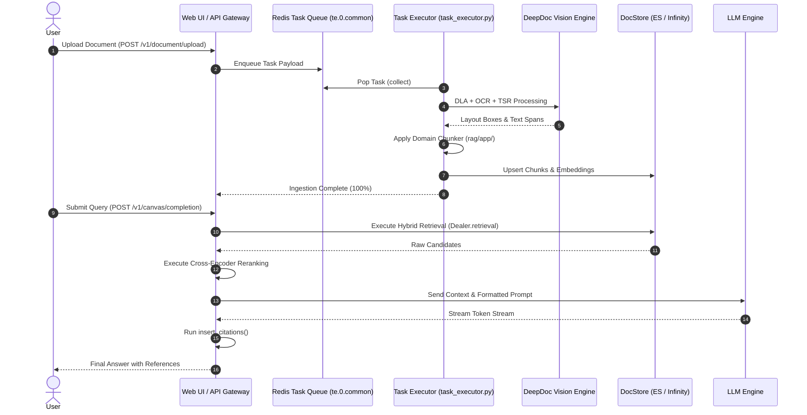

# End-to-End Complete RAG Execution Flow

## Level 1: Conceptual Overview

The complete RAG flow spans document upload, asynchronous worker queue ingestion, layout recognition, domain-specific chunking, multi-engine vector indexing, hybrid retrieval, neural reranking, context construction, and streaming LLM generation with inline citations.

---

## Level 2: Implementation Details

### Complete End-to-End Sequence Diagram

### Complete Source Code Map

2. **Task Queue Worker**: [rag/svr/task_executor.py](file:///home/logan78/Desktop/ragflow/rag/svr/task_executor.py#L220)
3. **DeepDoc Layout Engine**: [deepdoc/vision/layout_recognizer.py](file:///home/logan78/Desktop/ragflow/deepdoc/vision/layout_recognizer.py#L33)
4. **Hybrid Retrieval Dealer**: [rag/nlp/search.py](file:///home/logan78/Desktop/ragflow/rag/nlp/search.py#L39)
5. **Full-text Query Builder**: [rag/nlp/query.py](file:///home/logan78/Desktop/ragflow/rag/nlp/query.py#L28)
6. **DocStore Connections**: [rag/utils/es_conn.py](file:///home/logan78/Desktop/ragflow/rag/utils/es_conn.py#L40) / [infinity_conn.py](file:///home/logan78/Desktop/ragflow/rag/utils/infinity_conn.py#L35)
