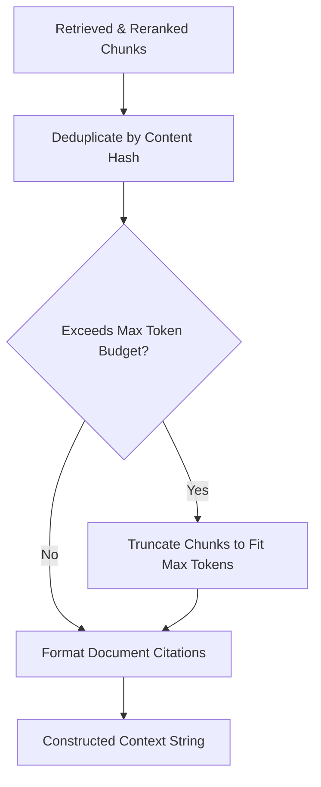

# Context Construction Subsystem

## Level 1: Conceptual Overview

Context Construction selects, formats, deduplicates, and orders retrieved candidate document chunks into a coherent context block. This context block is injected into the LLM system prompt to provide factual grounding.

---

## Level 2: Implementation Details

### Context Building Workflow

Implemented in `api/db/services/dialog_service.py` and `rag/app/`:



### Formatting Rules

1. **Document Citation Indexing**: Chunks are labeled with explicit numeric identifiers `[Document #1]`, `[Document #2]`, matching original document titles and page numbers.
2. **Metadata Injection**: Position coordinates, document titles, and section headers are prefixed to chunk bodies:
   ```
   [Document 1] Title: Annual_Report.pdf (Page 5)
   Content: Revenue increased by 15% in Q3...
   ```
3. **Citation Insertion (`insert_citations`)**:
   In [rag/nlp/search.py](file:///home/logan78/Desktop/ragflow/rag/nlp/search.py#L252-L310):
   Post-processes LLM response text, computing sentence-level vector similarity against chunk texts to insert reference tags `[1]`, `[2]` into the output.
