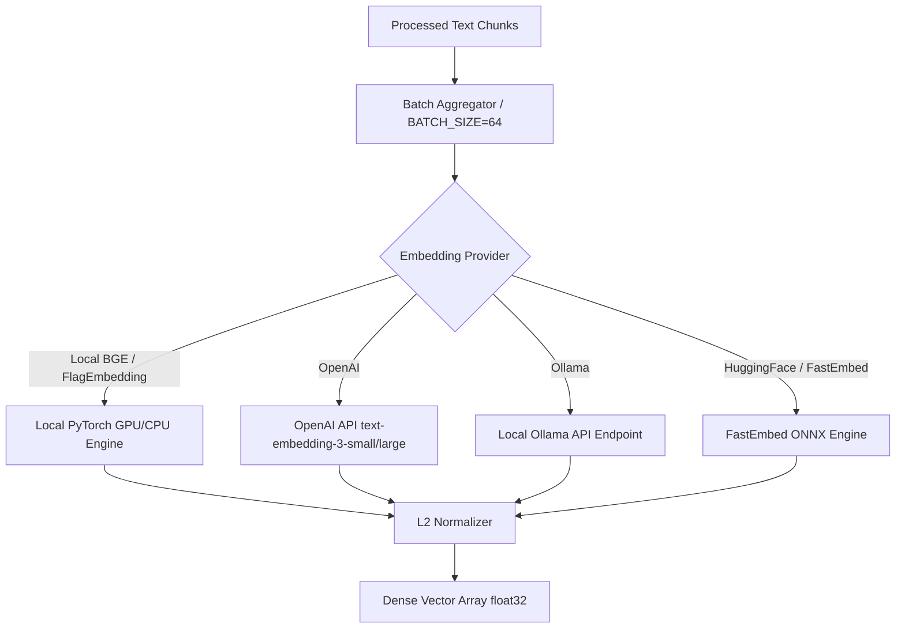

# Vector Embedding Subsystem

## Level 1: Conceptual Overview

The Vector Embedding subsystem transforms processed text chunks and user queries into high-dimensional numerical vectors. These dense vector representations capture semantic meaning, enabling semantic similarity search in vector databases (Infinity, Elasticsearch, OceanBase).

---

## Level 2: Implementation Details

### Embedding Model Architecture

Implemented in `rag/llm/embedding_model.py` and invoked by task executor [rag/svr/task_executor.py](file:///home/logan78/Desktop/ragflow/rag/svr/task_executor.py#L111-L128).



### Dynamic Vector Column Naming Scheme

To accommodate multiple embedding models with varying dimension sizes (e.g. 384, 768, 1024, 1536, 3072), RAGFlow dynamically names vector fields in DocStore schema:

Field Name Formula: `q_{dimension}_vec`
- 768-dim model (e.g. `bge-base-en`): `q_768_vec`
- 1024-dim model (e.g. `bge-large-zh`): `q_1024_vec`
- 1536-dim model (e.g. OpenAI `text-embedding-3-small`): `q_1536_vec`

Code reference in [rag/nlp/search.py](file:///home/logan78/Desktop/ragflow/rag/nlp/search.py#L61):
```python
vector_column_name = f"q_{len(embedding_data)}_vec"
```

### Mathematical Formula: Cosine Similarity

Given a query vector $\vec{Q}$ and document chunk vector $\vec{D}$ of dimension $d$:

$$\text{Cosine}(\vec{Q}, \vec{D}) = \frac{\vec{Q} \cdot \vec{D}}{\|\vec{Q}\|_2 \|\vec{D}\|_2} = \frac{\sum_{i=1}^{d} Q_i D_i}{\sqrt{\sum_{i=1}^{d} Q_i^2} \cdot \sqrt{\sum_{i=1}^{d} D_i^2}}$$

When vectors are $L_2$-normalized ($\|\vec{Q}\|_2 = 1$ and $\|\vec{D}\|_2 = 1$), Cosine Similarity simplifies to dot product:

$$\text{Cosine}(\vec{Q}, \vec{D}) = \sum_{i=1}^{d} Q_i D_i$$
