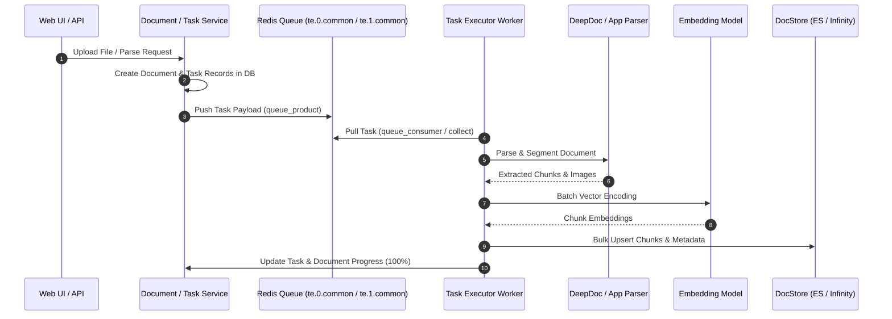

# Ingestion Pipeline

## Level 1: Conceptual Overview

The Document Ingestion Pipeline in RAGFlow converts raw binary document files into structured, tokenized, embedded, and indexed searchable chunks. It handles task generation, distributed queue consumption, multi-stage document processing, chunk extraction, vector embedding, and index insertion into vector databases.



---

## Level 2: Implementation Details

### Priority Queue Routing
Queue names are generated by `get_svr_queue_name()` in [common/settings.py](file:///home/logan78/Desktop/ragflow/common/settings.py#L139-L163):
- High Priority Tasks (Priority 1): `te.1.common`
- Normal Priority Tasks (Priority 0): `te.0.common`

Tasks are pushed to Redis by `DocumentService.bulk_predict()` or `TaskService.create_task()` in [api/db/services/document_service.py](file:///home/logan78/Desktop/ragflow/api/db/services/document_service.py#L1295):
```python
assert REDIS_CONN.queue_product(settings.get_svr_queue_name(priority, ty), message=task)
```

### Worker Collection Loop
The worker loop is implemented in [rag/svr/task_executor.py](file:///home/logan78/Desktop/ragflow/rag/svr/task_executor.py#L220-L260):

```python
async def collect():
    global CONSUMER_NAME, UNACKED_ITERATOR
    svr_queue_names = settings.get_svr_queue_names(TASK_TYPE)  # ["te.1.common", "te.0.common"]
    redis_msg = None
    if not UNACKED_ITERATOR:
        UNACKED_ITERATOR = REDIS_CONN.get_unacked_iterator(svr_queue_names, SVR_CONSUMER_GROUP_NAME, CONSUMER_NAME)
    try:
        redis_msg = next(UNACKED_ITERATOR)
    except StopIteration:
        for svr_queue_name in svr_queue_names:
            redis_msg = REDIS_CONN.queue_consumer(svr_queue_name, SVR_CONSUMER_GROUP_NAME, CONSUMER_NAME)
            if redis_msg:
                break
```

### Execution Call Flow & State Machine

1. **Task Fetching & Lock**: Worker consumes Redis message, acquires lock for task ID using `RedisDistributedLock` in [rag/utils/redis_conn.py](file:///home/logan78/Desktop/ragflow/rag/utils/redis_conn.py#L120).
2. **Parser Initialization**: `FACTORY[parser_id]` resolves appropriate module in [rag/svr/task_executor.py](file:///home/logan78/Desktop/ragflow/rag/svr/task_executor.py#L111-L128).
3. **Chunking**: Executes `chunk()` on parser, generating chunk dicts with content, positions, and images.
4. **Vector Encoding**: `embd_mdl.encode()` calculates dense float vectors for chunk text blocks.
5. **Bulk Indexing**: `DocStore.insert()` pushes formatted chunks to Elasticsearch/Infinity in batches of 64 (`BATCH_SIZE = 64`).
6. **Progress Reporting**: `set_progress()` updates task percentage (0.0 to 1.0) and status message in [api/db/services/task_service.py](file:///home/logan78/Desktop/ragflow/api/db/services/task_service.py#L200) and [api/db/db_models.py](file:///home/logan78/Desktop/ragflow/api/db/db_models.py#L1002-L1018).

### Go Ingestion Engine
For enterprise high-concurrency ingestion pipelines, Go implementation lives in:
- Component Chunker: [internal/ingestion/component/chunker/](file:///home/logan78/Desktop/ragflow/internal/ingestion/component/chunker/)
- Task DAO: [internal/dao/ingestion.go](file:///home/logan78/Desktop/ragflow/internal/dao/ingestion.go#L30-L60)
