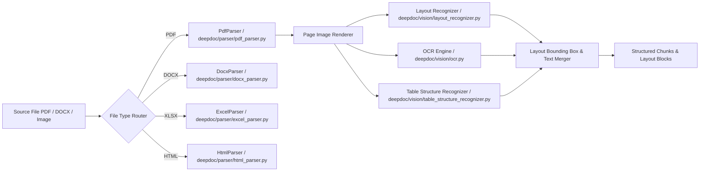

# Document Parsing Subsystem

## Level 1: Conceptual Overview

Document Parsing in RAGFlow converts heterogeneous source formats (PDF, DOCX, XLSX, PPTX, HTML, TXT, EPUB, images) into a unified visual layout and structured content stream.

Instead of treating documents as simple raw text streams, RAGFlow employs vision-first parsing through **DeepDoc**. DeepDoc renders document pages into high-resolution images, executes layout recognition (detecting titles, paragraphs, tables, images, headers, footers), performs OCR where text layer is missing/corrupted, and reconstructs reading order and hierarchical structure.

---

## Level 2: Implementation Details

### DeepDoc Parser Implementations

| Format | Python Implementation | Go Implementation | Description |
| :--- | :--- | :--- | :--- |
| **PDF** | [deepdoc/parser/pdf_parser.py](file:///home/logan78/Desktop/ragflow/deepdoc/parser/pdf_parser.py#L35) | [internal/deepdoc/parser/pdf/parser.go](file:///home/logan78/Desktop/ragflow/internal/deepdoc/parser/pdf/parser.go#L40) | Renders pages via PyMuPDF/pdfium, runs DLA YOLOv10/ONNX models, merges text boxes and table matrices. |
| **DOCX** | [deepdoc/parser/docx_parser.py](file:///home/logan78/Desktop/ragflow/deepdoc/parser/docx_parser.py#L25) | [internal/deepdoc/parser/docx/parser.go](file:///home/logan78/Desktop/ragflow/internal/deepdoc/parser/docx/parser.go#L30) | Extracts python-docx XML elements, headings, embedded images, and HTML table representations. |
| **Excel** | [deepdoc/parser/excel_parser.py](file:///home/logan78/Desktop/ragflow/deepdoc/parser/excel_parser.py#L20) | - | Parses openpyxl workbooks, converts sheets to HTML tables, preserves cell alignments and formulas. |
| **HTML** | [deepdoc/parser/html_parser.py](file:///home/logan78/Desktop/ragflow/deepdoc/parser/html_parser.py#L18) | - | BeautifulSoup processing, DOM tree extraction, script/style stripping. |
| **PPTX** | [deepdoc/parser/ppt_parser.py](file:///home/logan78/Desktop/ragflow/deepdoc/parser/ppt_parser.py#L20) | - | Slide-by-slide text frame extraction, shape ordering, and image extraction. |
| **TXT** | [deepdoc/parser/txt_parser.py](file:///home/logan78/Desktop/ragflow/deepdoc/parser/txt_parser.py#L15) | - | Encoding auto-detection (chardet/utf-8), paragraph line splitting. |
| **Docling / MinerU** | [deepdoc/parser/docling_parser.py](file:///home/logan78/Desktop/ragflow/deepdoc/parser/docling_parser.py#L20), [mineru_parser.py](file:///home/logan78/Desktop/ragflow/deepdoc/parser/mineru_parser.py#L20) | - | Integration wrappers for Docling and MinerU PDF parsers. |

### PDF Parsing & Layout Execution Code Flow

In `PdfParser.__call__()` ([deepdoc/parser/pdf_parser.py](file:///home/logan78/Desktop/ragflow/deepdoc/parser/pdf_parser.py#L120)):
1. **Page Rasterization**: Converts PDF pages to numpy images at `zoom=3` resolution.
2. **Text Character Extraction**: Uses PyMuPDF (`fitz`) to extract text spans and character bounding boxes `(x0, top, x1, bottom)`.
3. **Layout Detection**: Passes image batch to `LayoutRecognizer` in [deepdoc/vision/layout_recognizer.py](file:///home/logan78/Desktop/ragflow/deepdoc/vision/layout_recognizer.py#L68).
4. **OCR Fallback**: If character count per page is low, triggers PaddleOCR / ONNX OCR in [deepdoc/vision/ocr.py](file:///home/logan78/Desktop/ragflow/deepdoc/vision/ocr.py#L30).
5. **Table Reconstruction**: Tables are cropped and processed with `TableStructureRecognizer` in [deepdoc/vision/table_structure_recognizer.py](file:///home/logan78/Desktop/ragflow/deepdoc/vision/table_structure_recognizer.py#L40) to generate HTML string `<table>...</table>`.
