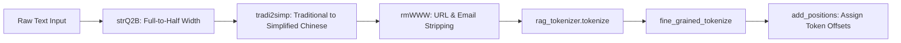

# Text Preprocessing & Tokenization

## Level 1: Conceptual Overview

Text preprocessing transforms raw document chunks and search queries into clean, normalized token sequences. It handles language detection, traditional-to-simplified Chinese conversion, full-width to half-width character normalization, tokenization via native C++ Trie bindings, stopword stripping, and term-position indexing.

---

## Level 2: Implementation Details

### NLP Preprocessing Pipeline

Implemented in [rag/nlp/rag_tokenizer.py](file:///home/logan78/Desktop/ragflow/rag/nlp/rag_tokenizer.py#L20) and [rag/nlp/query.py](file:///home/logan78/Desktop/ragflow/rag/nlp/query.py#L40):



### Preprocessing Operations

1. **Character Normalization (`strQ2B`)**:
   Converts full-width ASCII characters (e.g. `＇`, `％`) to half-width equivalents:
   ```python
   def strQ2B(ustr):
       rstring = ""
       for uchar in ustr:
           inside_code = ord(uchar)
           if inside_code == 12288: # space
               inside_code = 32
           elif 65281 <= inside_code <= 65374:
               inside_code -= 65248
           rstring += chr(inside_code)
       return rstring
   ```

2. **Traditional to Simplified Chinese (`tradi2simp`)**:

3. **URL & Noise Filtering (`rmWWW`)**:
   Strips http/https links, email addresses, and Infinity lexer special characters `[\x20()^"'~*?:\\]`.

4. **Fine-Grained Tokenization (`fine_grained_tokenize`)**:
   Splits compound words into smaller atomic sub-tokens (e.g. `RetrievalAugmented` -> `retrieval`, `augmented`) to ensure high recall in full-text BM25 search.

5. **Position Tagging (`add_positions`)**:
   Calculates char offset ranges `[start_char, end_char]` for highlight generation and PDF bounding-box bounding overlay in UI.
