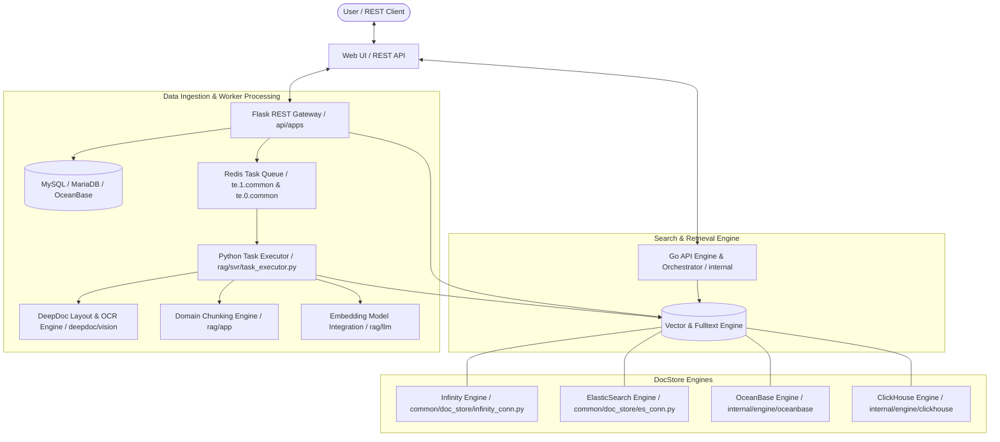

# RAG Architectural Overview

## Level 1: Conceptual Overview

RAGFlow is an enterprise-grade Retrieval-Augmented Generation (RAG) platform designed to process complex, unstructured heterogenous documents (PDFs, Office files, images, markdown, HTML, audio, structured tables) with deep document layout understanding and domain-adapted chunking strategies.

The system combines a high-concurrency **Go core engine** (`internal/`) for metadata operations, API management, and streaming retrieval with a compute-heavy **Python worker subsystem** (`rag/` and `deepdoc/`) that executes Optical Character Recognition (OCR), Layout Analysis, Vision parsing, text tokenization, and vector embedding generation.



### Key Architectural Pillars
1. **Hybrid Dual-Engine System**: Go handles lightweight API requests, high-throughput session streams, and DB DAOs (`internal/dao/`). Python handles layout vision models (`deepdoc/vision/`), NLP tokenization (`rag/nlp/`), embedding encoding (`rag/llm/`), and multi-method parsing (`rag/app/`).
2. **Deep Document Layout Analysis**: DeepDoc (`deepdoc/vision/layout_recognizer.py`, `ocr.py`, `table_structure_recognizer.py`) segments visual elements (Headers, Footers, Tables, Figures, Titles, Equations) using fine-tuned object detection and layout recognition.
3. **Pluggable Multi-Backend DocStore**: Unified database abstraction supporting **Infinity** (InfiniFlow high-performance vector DB), **ElasticSearch**, **OceanBase**, **ClickHouse**, and **SereneDB**.
4. **Multi-Stage Hybrid Search & Reranking**: Blends vector cosine similarity, BM25 full-text term scoring, PageRank feature weights, and cross-encoder neural reranking.

---

## Level 2: Implementation Details

### End-to-End Call Chain

```
[User/API] -> POST /v1/document/upload -> api/apps/document_app.py:upload()
  -> FileService.upload_document() [api/db/services/file_service.py]
  -> DocumentService.create() [api/db/services/document_service.py]
  -> TaskService.create_task() [api/db/services/task_service.py]
  -> REDIS_CONN.queue_product("te.0.common", task) [rag/utils/redis_conn.py]
  
[Redis Queue: te.0.common] -> TaskExecutor.collect() [rag/svr/task_executor.py:L220]
  -> TaskExecutor.run_tenant_task() [rag/svr/task_executor.py:L1150]
  -> FACTORY[parser_id].chunk() [rag/app/naive.py | paper.py | book.py ...]
  -> DeepDoc.LayoutRecognizer() / OCR() [deepdoc/vision/layout_recognizer.py]
  -> EmbeddingModel.encode() [rag/llm/embedding_model.py]
  -> DocStore.insert() [rag/utils/es_conn.py / infinity_conn.py]
  -> TaskService.update_progress(1.0, TaskStatus.DONE)
```

### System Subsystem Map

| Subsystem | Primary Language | File Path & Code Link | Primary Responsibility |
| :--- | :--- | :--- | :--- |
| **Task Queue & Executor** | Python | [rag/svr/task_executor.py](file:///home/logan78/Desktop/ragflow/rag/svr/task_executor.py#L220), [common/settings.py](file:///home/logan78/Desktop/ragflow/common/settings.py#L139) | Redis stream consumer, concurrency limiter, status updates |
| **DeepDoc Vision** | Python / C++ | [deepdoc/vision/layout_recognizer.py](file:///home/logan78/Desktop/ragflow/deepdoc/vision/layout_recognizer.py#L33), [deepdoc/vision/ocr.py](file:///home/logan78/Desktop/ragflow/deepdoc/vision/ocr.py#L25) | YOLO/ONNX DLA models, PaddleOCR engine, TSR model |
| **Parser & Chunkers** | Python / Go | [rag/app/naive.py](file:///home/logan78/Desktop/ragflow/rag/app/naive.py#L30), [internal/ingestion/component/chunker/](file:///home/logan78/Desktop/ragflow/internal/ingestion/component/chunker/) | 14 domain-specific chunking implementations |
| **NLP Tokenization** | Python / C++ | [rag/nlp/rag_tokenizer.py](file:///home/logan78/Desktop/ragflow/rag/nlp/rag_tokenizer.py#L20), [rag/nlp/query.py](file:///home/logan78/Desktop/ragflow/rag/nlp/query.py#L28) | Fine-grained C++ tokenization, synonym expansion, query building |
| **Search & Retrieval** | Python | [rag/nlp/search.py](file:///home/logan78/Desktop/ragflow/rag/nlp/search.py#L39) | `Dealer` hybrid retrieval engine, vector KNN, BM25, RRF fusion |
| **DocStore Engine** | Python / Go | [rag/utils/es_conn.py](file:///home/logan78/Desktop/ragflow/rag/utils/es_conn.py#L40), [internal/engine/](file:///home/logan78/Desktop/ragflow/internal/engine/) | Elasticsearch, Infinity, OceanBase connection adapters |
