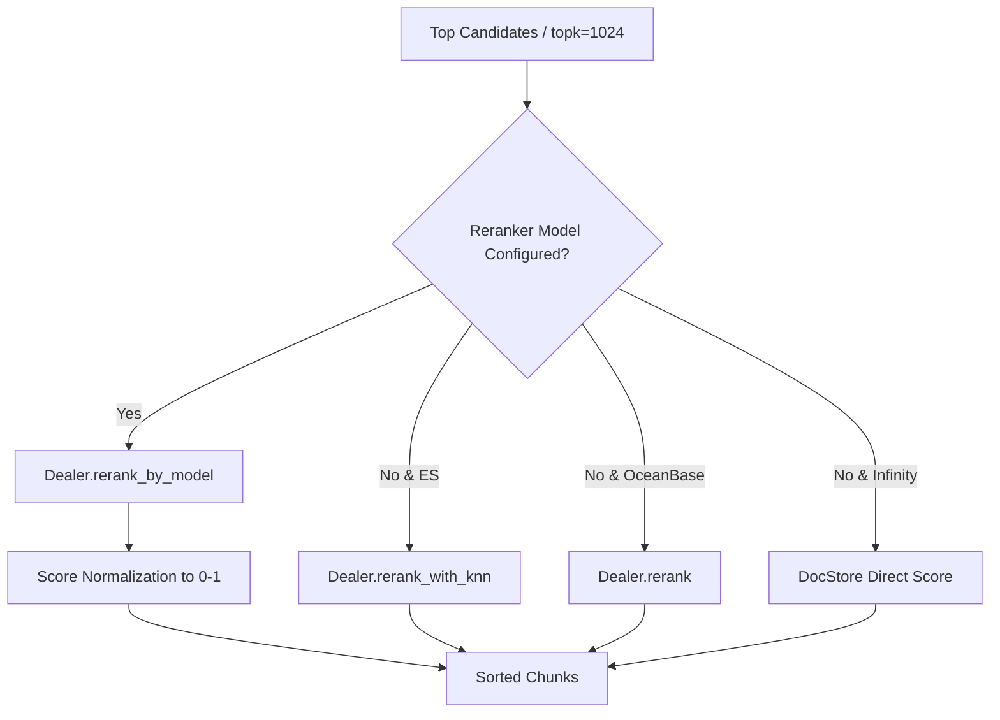

# Re-ranking Subsystem

## Level 1: Conceptual Overview

Re-ranking is the multi-stage refinement step in the RAG retrieval pipeline. While first-pass retrieval extracts a top candidate set (e.g., top 1024 candidates) using lightweight vector index matches and BM25 term frequencies, the Re-ranking subsystem applies computationally heavy cross-encoder neural models to evaluate fine-grained sentence pair semantic relevance.

---

## Level 2: Implementation Details

### Reranking Modes

Implemented in `rag/nlp/search.py` ([rag/nlp/search.py](file:///home/logan78/Desktop/ragflow/rag/nlp/search.py#L434-L520)):



### Reranking Functions

1. **Cross-Encoder Model Reranking (`rerank_by_model`)**:
   In [rag/nlp/search.py](file:///home/logan78/Desktop/ragflow/rag/nlp/search.py#L494-L519):
   ```python
   def rerank_by_model(self, rerank_mdl, sres, query, tkweight=0.3, vtweight=0.7, cfield="content_ltks", rank_feature=None):
       _, keywords = self.qryr.question(query)
       docs = [remove_redundant_spaces(" ".join(tks)) for tks in ins_tw]
       tksim = self.qryr.token_similarity(keywords, ins_tw)
       vtsim, _ = rerank_mdl.similarity(query, docs)
       rank_fea = self._rank_feature_scores(rank_feature, sres)
       return tkweight * np.array(tksim) + vtweight * vtsim + rank_fea, tksim, vtsim
   ```

2. **KNN + Term Heuristic Reranking (`rerank_with_knn`)**:
   In [rag/nlp/search.py](file:///home/logan78/Desktop/ragflow/rag/nlp/search.py#L434-L460):
   Combines Elasticsearch second-pass KNN cosine score with local token overlap without fetching raw vector arrays over the network.
