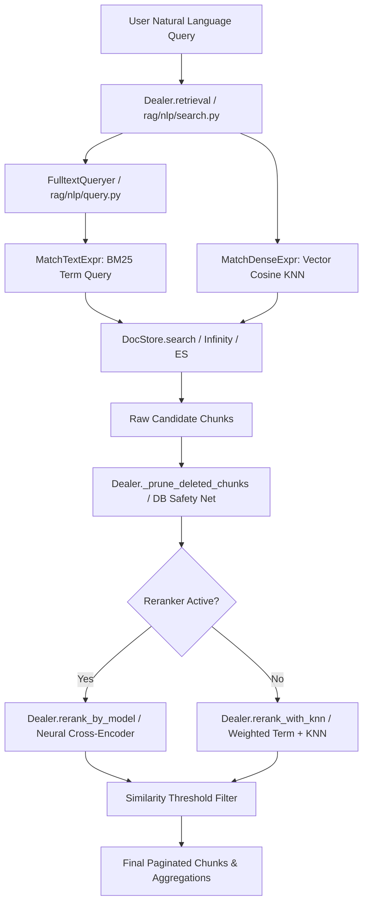

# Retrieval Subsystem

## Level 1: Conceptual Overview

The Retrieval Subsystem handles multi-vector and full-text querying across user knowledge bases. It accepts user questions, builds combined search expressions, queries the underlying DocStore engine, prunes orphaned or deleted chunks, applies score thresholding, and paginates candidate chunks.



---

## Level 2: Implementation Details

### `Dealer.retrieval()` Flow

Implemented in [rag/nlp/search.py](file:///home/logan78/Desktop/ragflow/rag/nlp/search.py#L549-L720):

```python
async def retrieval(
    self,
    question,
    embd_mdl,
    tenant_ids,
    kb_ids,
    page,
    page_size,
    similarity_threshold=0.2,
    vector_similarity_weight=0.3,
    top=1024,
    doc_ids=None,
    rerank_mdl=None,
    highlight=False,
    rank_feature={PAGERANK_FLD: 10},
):
```

### Key Sub-routines in Retrieval

1. **Windowed Block Pagination (`_rerank_window`)**:
   In [rag/nlp/search.py](file:///home/logan78/Desktop/ragflow/rag/nlp/search.py#L524-L547):
   Calculates window size $W = \lceil 64 / \text{page\_size} \rceil \cdot \text{page\_size}$ to ensure deep pagination never drifts across candidate blocks.

2. **Stale Chunk Pruning (`_prune_deleted_chunks`)**:
   In [rag/nlp/search.py](file:///home/logan78/Desktop/ragflow/rag/nlp/search.py#L77-L120):
   Checks retrieved chunk `doc_id` list against active relational database records (`DocumentService.get_by_ids`), dropping chunks from deleted documents.

3. **KNN Cosine Score Recovery (`_knn_scores`)**:
   In [rag/nlp/search.py](file:///home/logan78/Desktop/ragflow/rag/nlp/search.py#L363-L395):
   Executes second-pass vector-only search on Elasticsearch to compute exact cosine similarity scores without transferring large vector arrays back to application processes.
