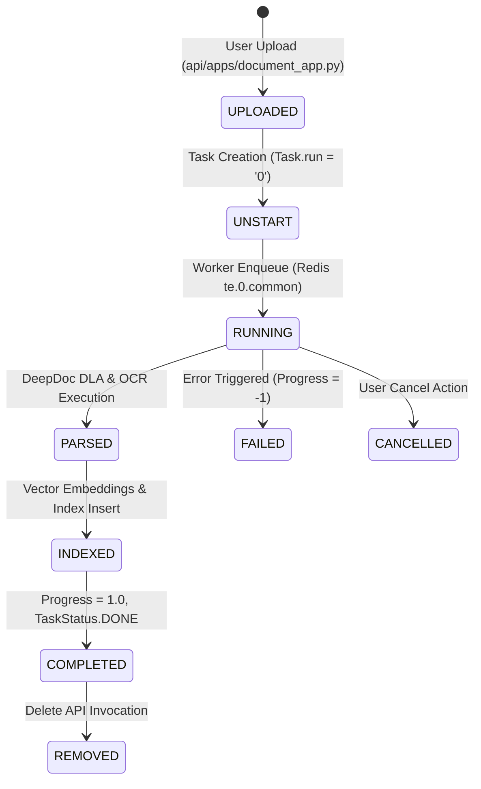

# Document Processing Lifecycle

## Level 1: Conceptual Overview

The Document Lifecycle tracks a file from initial upload through storage, parsing, visual layout analysis, chunking, indexing, and eventual deletion. The document transitions through strict state machine phases backed by relational database tables (`Document`, `Task`, `File`) and distributed Redis state notifications.

---

## Level 2: Implementation Details

### Document Status Enum Values

Defined in [common/constants.py](file:///home/logan78/Desktop/ragflow/common/constants.py#L50) and [api/db/db_models.py](file:///home/logan78/Desktop/ragflow/api/db/db_models.py#L894):

- `run`: Task execution state (`"0"` = Unstarted, `"1"` = Running, `"2"` = Cancelled, `"3"` = Finished, `"4"` = Failed)
- `status`: Validation flag (`"1"` = Active, `"0"` = Deleted/Wasted)
- `progress`: Floating point completion percentage (0.0 to 1.0, `-1.0` on failure)

### Lifecycle Handlers

| Phase | Python Service Method | Go DAO Method | Primary File |
| :--- | :--- | :--- | :--- |
| **Upload** | `FileService.upload_document()` | `DocumentDAO.Create()` | [api/db/services/file_service.py](file:///home/logan78/Desktop/ragflow/api/db/services/file_service.py#L50), [internal/dao/document.go](file:///home/logan78/Desktop/ragflow/internal/dao/document.go#L30) |
| **Task Creation** | `TaskService.create_task()` | `IngestionTaskDAO.Create()` | [api/db/services/task_service.py](file:///home/logan78/Desktop/ragflow/api/db/services/task_service.py#L50), [internal/dao/ingestion.go](file:///home/logan78/Desktop/ragflow/internal/dao/ingestion.go#L36) |
| **Parsing** | `task_executor.run_tenant_task()` | - | [rag/svr/task_executor.py](file:///home/logan78/Desktop/ragflow/rag/svr/task_executor.py#L1150) |
| **Deletion** | `DocumentService.remove_document()` | `DocumentDAO.Delete()` | [api/db/services/document_service.py](file:///home/logan78/Desktop/ragflow/api/db/services/document_service.py#L200), [internal/dao/document.go](file:///home/logan78/Desktop/ragflow/internal/dao/document.go#L80) |
