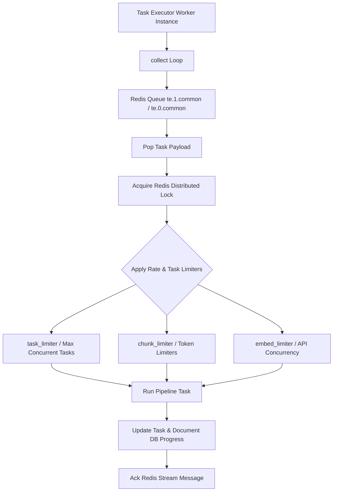

# Document Processing Workers Architecture

## Level 1: Conceptual Overview

Document Processing Workers are asynchronous background execution units that poll Redis queues, deserialize document task messages, invoke DeepDoc vision models and domain chunkers, encode vector embeddings, and write results to DocStore database engines.

---

## Level 2: Implementation Details

### Worker Process Loop & Concurrency Limiters

Worker entry point: [rag/svr/task_executor.py](file:///home/logan78/Desktop/ragflow/rag/svr/task_executor.py#L220).

### Rate & Concurrency Limiters

Imported in [rag/svr/task_executor.py](file:///home/logan78/Desktop/ragflow/rag/svr/task_executor.py#L92-L98) from `rag/svr/task_executor_limiter.py`:
- `task_limiter`: Controls maximum parallel parsing tasks per node.
- `chunk_limiter`: Throttles text chunking buffer allocations.
- `embed_limiter`: Controls max simultaneous requests to remote Embedding API endpoints.
- `minio_limiter`: Limits concurrent S3/MinIO binary download operations.
- `kg_limiter`: Throttles Knowledge Graph extraction tasks.
