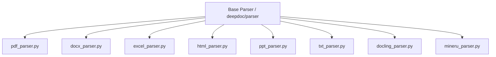

# Document Parsers Catalog

## Level 1: Conceptual Overview

Document Parsers ingest unstructured binary files and transform them into structured text streams enriched with bounding boxes, section titles, headers, footers, tables, and images.

---

## Level 2: Implementation Details

### Parser Class Architecture

All Python parsers are located in [deepdoc/parser/](file:///home/logan78/Desktop/ragflow/deepdoc/parser/).

### Source Code References

| File Name | Location Link | Primary Responsibility |
| :--- | :--- | :--- |
| `pdf_parser.py` | [deepdoc/parser/pdf_parser.py](file:///home/logan78/Desktop/ragflow/deepdoc/parser/pdf_parser.py#L35) | PDF layout recognition, text span extraction, table cropping |
| `docx_parser.py` | [deepdoc/parser/docx_parser.py](file:///home/logan78/Desktop/ragflow/deepdoc/parser/docx_parser.py#L25) | Word document XML parsing, image extraction, HTML table conversion |
| `excel_parser.py` | [deepdoc/parser/excel_parser.py](file:///home/logan78/Desktop/ragflow/deepdoc/parser/excel_parser.py#L20) | Excel workbook parsing, sheet HTML formatting |
| `html_parser.py` | [deepdoc/parser/html_parser.py](file:///home/logan78/Desktop/ragflow/deepdoc/parser/html_parser.py#L18) | Web HTML DOM cleaning, tag stripping |
| `ppt_parser.py` | [deepdoc/parser/ppt_parser.py](file:///home/logan78/Desktop/ragflow/deepdoc/parser/ppt_parser.py#L20) | PowerPoint slide shape extraction |
| `txt_parser.py` | [deepdoc/parser/txt_parser.py](file:///home/logan78/Desktop/ragflow/deepdoc/parser/txt_parser.py#L15) | Plain text auto-encoding parsing |
| `docling_parser.py` | [deepdoc/parser/docling_parser.py](file:///home/logan78/Desktop/ragflow/deepdoc/parser/docling_parser.py#L20) | Integration with IBM Docling PDF engine |
| `mineru_parser.py` | [deepdoc/parser/mineru_parser.py](file:///home/logan78/Desktop/ragflow/deepdoc/parser/mineru_parser.py#L20) | Integration with MinerU layout parser |
