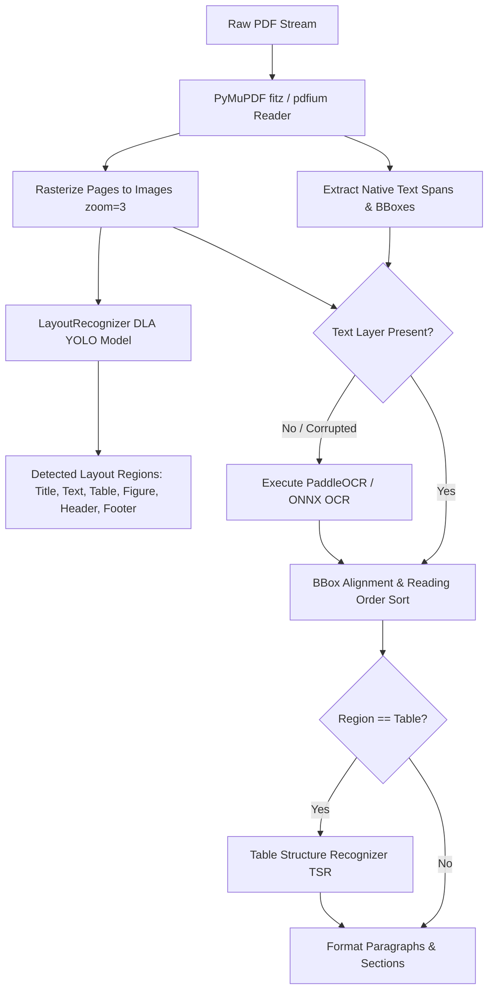

# PDF Processing Pipeline

## Level 1: Conceptual Overview

PDF Processing is the core pipeline of DeepDoc. PDFs present complex challenges: non-linear reading orders, multi-column layouts, embedded raster images, vector line tables, missing text layers (scanned documents), and complex equations.

---

## Level 2: Implementation Details

### Pipeline Execution Steps

Implemented in [deepdoc/parser/pdf_parser.py](file:///home/logan78/Desktop/ragflow/deepdoc/parser/pdf_parser.py#L35) and [internal/deepdoc/parser/pdf/parser.go](file:///home/logan78/Desktop/ragflow/internal/deepdoc/parser/pdf/parser.go#L40):

### Source File References
- Python PDF Parser: [deepdoc/parser/pdf_parser.py](file:///home/logan78/Desktop/ragflow/deepdoc/parser/pdf_parser.py#L35)
- Go PDF Engine: [internal/deepdoc/parser/pdf/parser.go](file:///home/logan78/Desktop/ragflow/internal/deepdoc/parser/pdf/parser.go#L40)
- Layout Boxes & Sections: [internal/deepdoc/parser/pdf/layout/boxes_sections.go](file:///home/logan78/Desktop/ragflow/internal/deepdoc/parser/pdf/layout/boxes_sections.go#L20)
