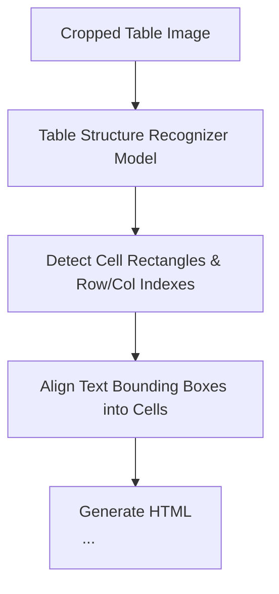

# Table Structure Recognition (TSR)

## Level 1: Conceptual Overview

Table Structure Recognition (TSR) reconstructs 2D grid matrix relationships (rows, columns, spanning cells, headers) from visual table images, converting tables into structured HTML strings.

---

## Level 2: Implementation Details

### Table Structure Recognition Pipeline

Implemented in [deepdoc/vision/table_structure_recognizer.py](file:///home/logan78/Desktop/ragflow/deepdoc/vision/table_structure_recognizer.py#L40) and [deepdoc/server/endpoints/tsr_endpoint.py](file:///home/logan78/Desktop/ragflow/deepdoc/server/endpoints/tsr_endpoint.py#L15).



### Table Context Prefixing

To maintain row-level semantics during retrieval, `rag/app/table.py` ([rag/app/table.py](file:///home/logan78/Desktop/ragflow/rag/app/table.py#L20)) prefixes table title and column header headers to every row chunk:

```
Table Title: Q3 Financial Summary
Columns: [Quarter, Revenue, Growth Rate, Operating Cost]
Row 1 Data: Q3 2024 | $12.5M | 15.2% | $8.1M
```
