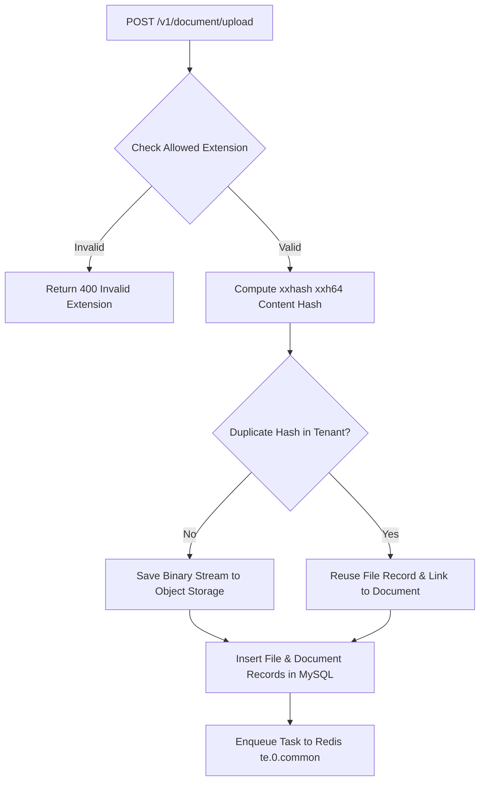

# Document Upload Subsystem

## Level 1: Conceptual Overview

The Document Upload subsystem accepts user file submissions via REST endpoints (`/v1/document/upload`), validates MIME types and file extensions, checks quota limits, computes content hashes, writes binary streams to object storage, and initializes metadata DB rows (`File`, `Document`, `File2Document`).

---

## Level 2: Implementation Details

### Upload Route & Controller Flow




### Content Hash Deduplication

To prevent storing redundant binary files, RAGFlow calculates `xxhash.xxh64` digest in [api/db/services/file_service.py](file:///home/logan78/Desktop/ragflow/api/db/services/file_service.py#L28):

```python
content_hash = xxhash.xxh64(file_bytes).hexdigest()
```

If `content_hash` matches an existing file in the same tenant, the binary upload to MinIO/S3 is skipped, and a new `Document` row referencing the existing storage location is registered.
