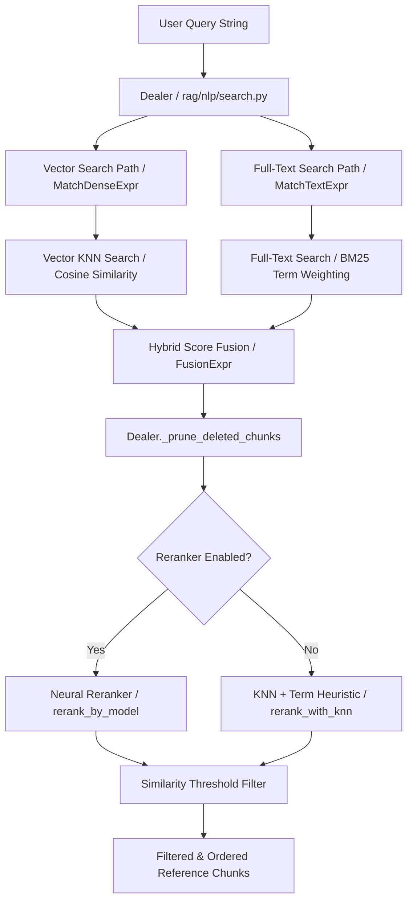

# Retrieval Subsystem Overview

## Level 1: Conceptual Overview

The Retrieval Subsystem in RAGFlow searches knowledge bases for relevant document chunks given a user prompt. It executes a hybrid search architecture combining vector KNN dense retrieval, full-text term matching (BM25), metadata filtering, PageRank weighting, and cross-encoder re-ranking.

---

## Level 2: Implementation Details

### System Component Map

| Component | File Path | Primary Function |
| :--- | :--- | :--- |
| **Search Dealer** | [rag/nlp/search.py](file:///home/logan78/Desktop/ragflow/rag/nlp/search.py#L39) | Central retrieval engine `Dealer` class, `retrieval()` and `search()` methods |
| **Fulltext Queryer** | [rag/nlp/query.py](file:///home/logan78/Desktop/ragflow/rag/nlp/query.py#L28) | `FulltextQueryer` class, query normalization, synonym lookup |
| **NLP Tokenizer** | [rag/nlp/rag_tokenizer.py](file:///home/logan78/Desktop/ragflow/rag/nlp/rag_tokenizer.py#L20) | Word segmentation, traditional/simplified Chinese conversion |
| **DocStore Engine** | [rag/utils/es_conn.py](file:///home/logan78/Desktop/ragflow/rag/utils/es_conn.py#L40), [infinity_conn.py](file:///home/logan78/Desktop/ragflow/rag/utils/infinity_conn.py#L35) | DB adapters translating `MatchTextExpr` and `MatchDenseExpr` into backend queries |
| **Go Engine** | [internal/engine/elasticsearch/chunk.go](file:///home/logan78/Desktop/ragflow/internal/engine/elasticsearch/chunk.go#L30) | High-performance Go retrieval driver |
