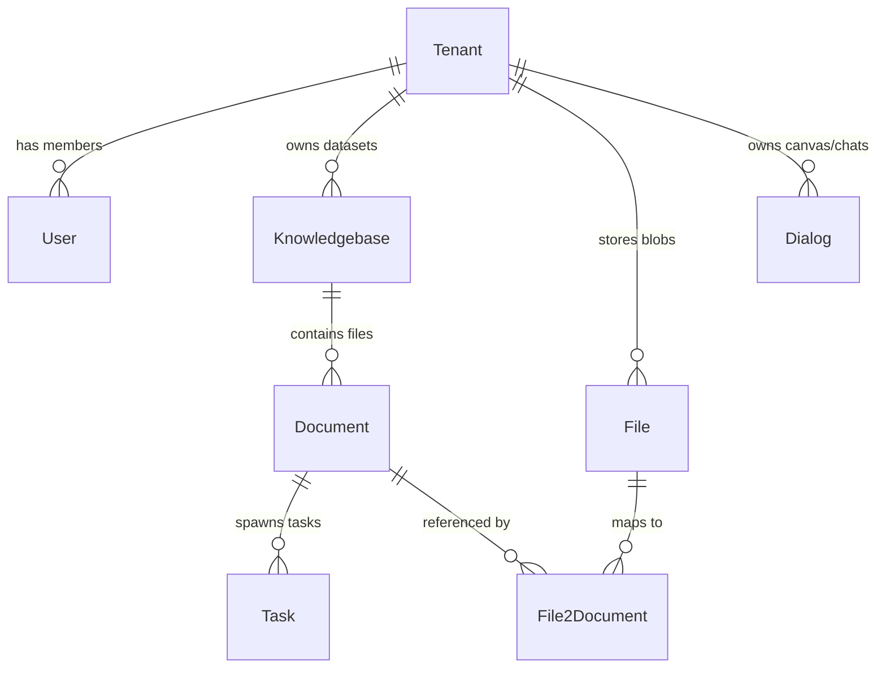

# Database Architecture Overview

## Level 1: Conceptual Overview

The Database Architecture in RAGFlow uses relational databases (MySQL, OceanBase, PostgreSQL) for metadata persistence, state tracking, tenant configuration, document records, task queues, and user authentication.

It features a dual-layer ORM/DAO pattern:
1. **Python Layer**: Uses Peewee ORM with connection-pooling retry classes (`RetryingPooledMySQLDatabase`, `RetryingPooledPostgresqlDatabase`, `RetryingPooledOceanBaseDatabase`) in [api/db/db_models.py](file:///home/logan78/Desktop/ragflow/api/db/db_models.py#L300-L465).
2. **Go Layer**: Uses GORM DAOs in [internal/dao/](file:///home/logan78/Desktop/ragflow/internal/dao/) for high-throughput API endpoints and ingestion pipeline state tracking.



---

## Level 2: Implementation Details

### Database Connection Pool with Automatic Retry

Implemented in [api/db/db_models.py](file:///home/logan78/Desktop/ragflow/api/db/db_models.py#L300-L465):

```python
class PooledDatabase(Enum):
    MYSQL = RetryingPooledMySQLDatabase
    OCEANBASE = RetryingPooledOceanBaseDatabase
    POSTGRES = RetryingPooledPostgresqlDatabase
```

Connection retry logic handles transient network drops (MySQL error codes 2006/2013, PostgreSQL 08006/57P01) with exponential backoff up to 5 retries.

### Python Peewee vs Go GORM DAO Mapping

| Entity | Peewee Python Model | Go GORM DAO Struct | Description |
| :--- | :--- | :--- | :--- |
| **Document** | [Document](file:///home/logan78/Desktop/ragflow/api/db/db_models.py#L894) | [DocumentDAO](file:///home/logan78/Desktop/ragflow/internal/dao/document.go#L30) | Document parsing state, token count, location |
| **Task** | [Task](file:///home/logan78/Desktop/ragflow/api/db/db_models.py#L1002) | [IngestionTaskDAO](file:///home/logan78/Desktop/ragflow/internal/dao/ingestion.go#L30) | Parsing progress, page ranges, chunk IDs |
| **Knowledgebase**| [Knowledgebase](file:///home/logan78/Desktop/ragflow/api/db/db_models.py#L837) | [KnowledgebaseDAO](file:///home/logan78/Desktop/ragflow/internal/dao/kb.go#L30) | Dataset configurations, embedding models |
| **File** | [File](file:///home/logan78/Desktop/ragflow/api/db/db_models.py#L924) | [FileDAO](file:///home/logan78/Desktop/ragflow/internal/dao/file.go#L30) | Blob file metadata, parent folder hierarchy |
| **File2Document** | [File2Document](file:///home/logan78/Desktop/ragflow/api/db/db_models.py#L939) | [File2DocumentDAO](file:///home/logan78/Desktop/ragflow/internal/dao/file2document.go#L30) | Join table mapping file objects to documents |
