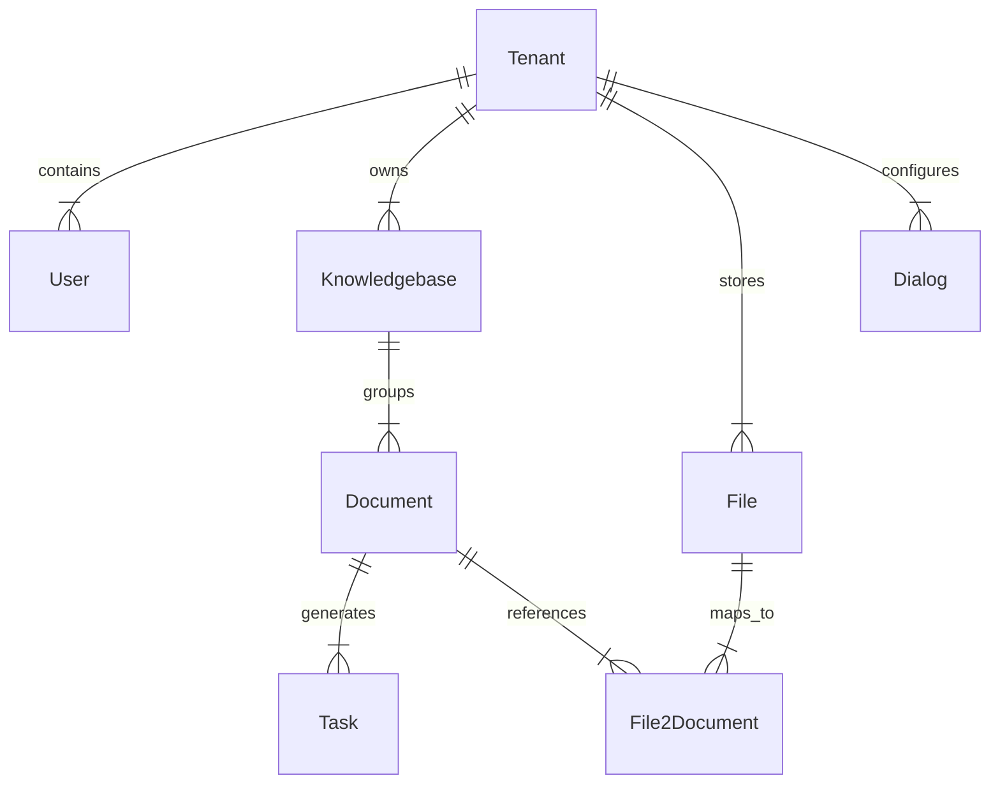

# Database Entity Relationships

## Level 1: Conceptual Overview

This document details primary key / foreign key relationships, cascade behaviors, and cardinality mappings between database entities.

---

## Level 2: Implementation Details

### Entity Relationship Diagram (ERD)

### Cardinality Summary

- `Tenant` -> `Knowledgebase`: 1-to-Many (`Knowledgebase.tenant_id`)
- `Knowledgebase` -> `Document`: 1-to-Many (`Document.kb_id`)
- `Document` -> `Task`: 1-to-Many (`Task.doc_id`)
- `File` <-> `Document`: Many-to-Many via `File2Document` (`file_id`, `document_id`)
