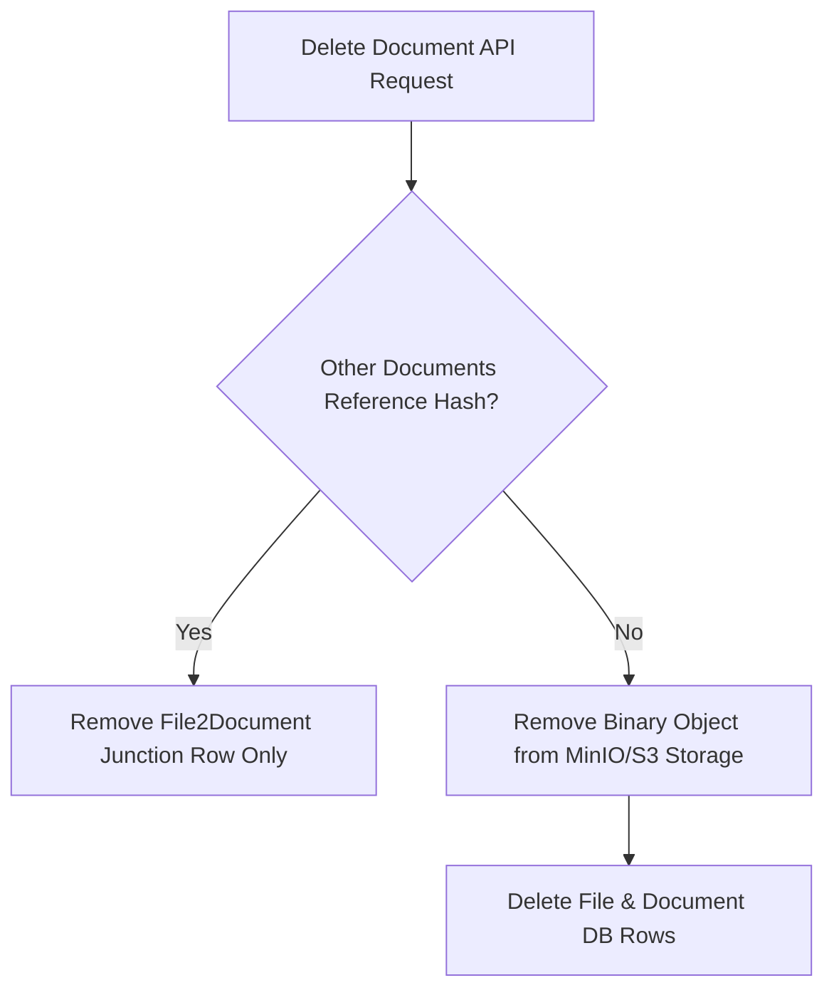

# File Lifecycle & Storage Cleanup

## Level 1: Conceptual Overview

The File Lifecycle oversees asset creation, content-hash deduplication, retention, reference counting, and garbage-collection cleanup when documents or datasets are deleted.

---

## Level 2: Implementation Details

### Deletion & Reference Counting

Implemented in `FileService.remove_file()` in [api/db/services/file_service.py](file:///home/logan78/Desktop/ragflow/api/db/services/file_service.py#L200):

1. **Junction Table Cleanup**: Deletes `File2Document` association records.
2. **Reference Audit**: Checks if remaining `File2Document` rows point to the target `file_id`.
3. **Blob Garbage Collection**: If reference count reaches zero, invokes `Storage.rm(bucket, location)` to free storage capacity.
