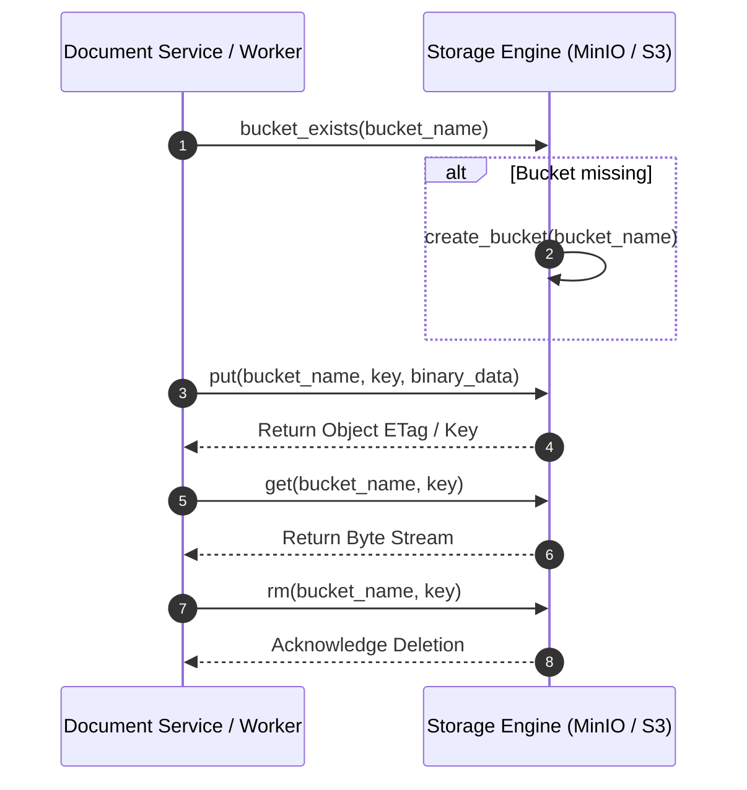

# Storage Operational Flow

## Level 1: Conceptual Overview

The Storage Operational Flow governs blob creation, key generation, bucket verification, binary streaming, and deletion workflows across the application lifecycle.

---

## Level 2: Implementation Details

### Binary Read & Write Flow

Key Generation Pattern:
- Source Files: `bucket: ragflow`, `key: {tenant_id}/{doc_id}`
- Image Thumbnails: `bucket: ragflow`, `key: {tenant_id}/{doc_id}/{img_id}.png`
