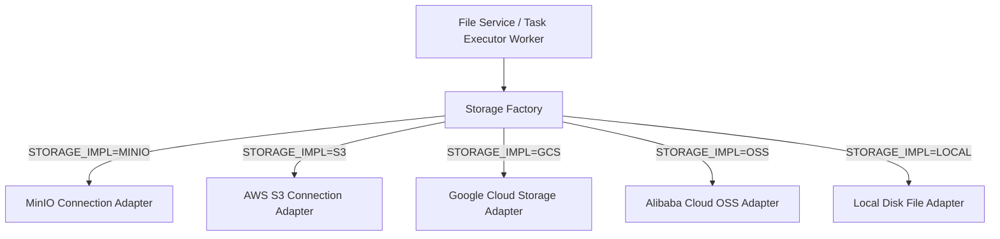

# Object & Blob Storage Overview

## Level 1: Conceptual Overview

The Storage Subsystem manages raw binary document files, extracted page images, cropped table screenshots, and avatar blobs. It provides a pluggable storage interface supporting **MinIO**, **Amazon S3**, **Google Cloud Storage (GCS)**, **Alibaba Cloud OSS**, and **Local Filesystem**.

---

## Level 2: Implementation Details

### Implementation Classes

- Python Factory: [rag/utils/storage_factory.py](file:///home/logan78/Desktop/ragflow/rag/utils/storage_factory.py#L20)
- Python MinIO Adapter: `rag/utils/minio_conn.py`
- Python S3 Adapter: `rag/utils/s3_conn.py`
- Go Factory: [internal/storage/storage_factory.go](file:///home/logan78/Desktop/ragflow/internal/storage/storage_factory.go#L40)
- Go MinIO Storage: [internal/storage/minio.go](file:///home/logan78/Desktop/ragflow/internal/storage/minio.go#L25)
- Go S3 Storage: [internal/storage/s3.go](file:///home/logan78/Desktop/ragflow/internal/storage/s3.go#L25)
- Go GCS Storage: [internal/storage/gcs.go](file:///home/logan78/Desktop/ragflow/internal/storage/gcs.go#L25)
- Go OSS Storage: [internal/storage/oss.go](file:///home/logan78/Desktop/ragflow/internal/storage/oss.go#L25)
