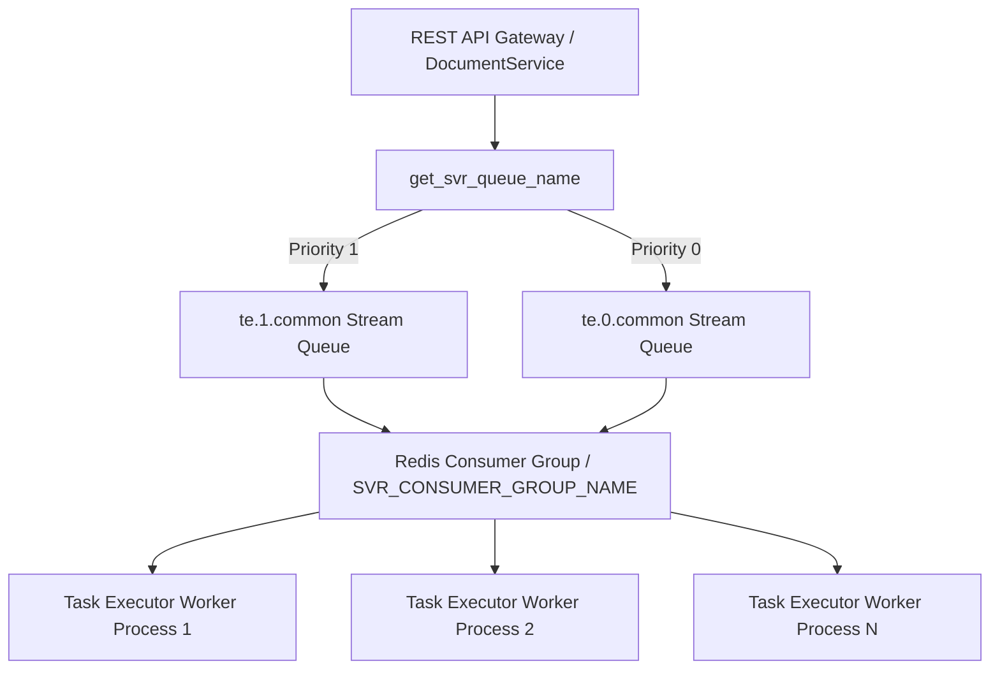

# Queue Infrastructure & Message Routing

## Level 1: Conceptual Overview

RAGFlow relies on Redis Streams as its primary distributed message queue system for offloading heavy document parsing, layout recognition, embedding generation, and Knowledge Graph extraction tasks from API HTTP threads to background worker pools.



---

## Level 2: Implementation Details

### Queue Naming Conventions

Generated by `get_svr_queue_name()` in [common/settings.py](file:///home/logan78/Desktop/ragflow/common/settings.py#L139-L163) using constant `SVR_QUEUE_NAME = "te"` from [common/constants.py](file:///home/logan78/Desktop/ragflow/common/constants.py#L314):

Formula: `{SVR_QUEUE_NAME}.{priority}.{suffix}`
- High Priority (Priority 1): `te.1.common`
- Normal Priority (Priority 0): `te.0.common`

### Queue Producers & Consumers

1. **Producer Implementation**:
   In `DocumentService.bulk_predict()` ([api/db/services/document_service.py](file:///home/logan78/Desktop/ragflow/api/db/services/document_service.py#L1295)) and [rag/utils/redis_conn.py](file:///home/logan78/Desktop/ragflow/rag/utils/redis_conn.py#L50):
   ```python
   REDIS_CONN.queue_product(queue_name, message=task_payload)
   ```
   Uses Redis `XADD` command to push task JSON dictionary into target stream.

2. **Consumer Implementation**:
   In `task_executor.collect()` ([rag/svr/task_executor.py](file:///home/logan78/Desktop/ragflow/rag/svr/task_executor.py#L220-L248)):
   Uses Redis `XREADGROUP` command to fetch unacknowledged (`UNACKED_ITERATOR`) or new messages from consumer group `SVR_CONSUMER_GROUP_NAME`.
