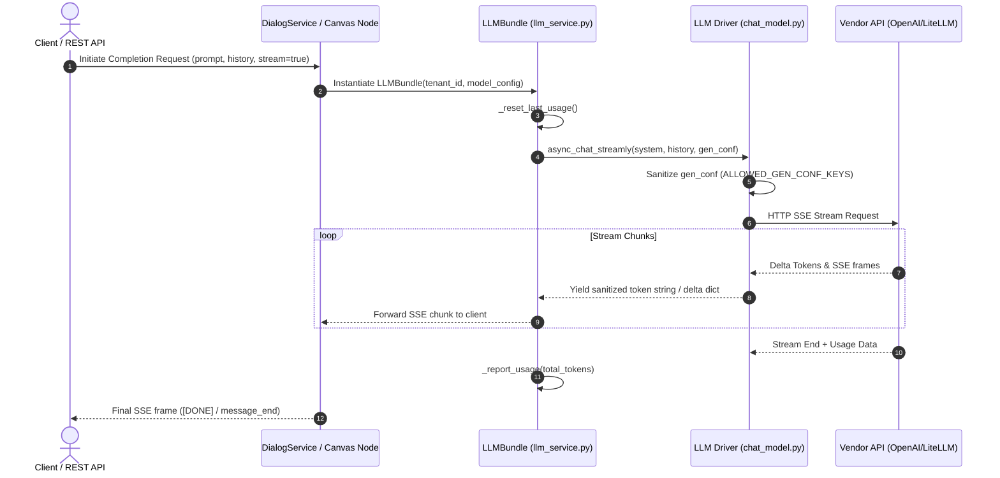

# LLM Request Flow & Streaming Protocol

## Level 1: Conceptual Overview

The **LLM Request Flow** handles prompt assembly, credential lookup, parameter sanitization, API execution, stream chunk transformation, token usage accounting, and citation parsing. RAGFlow supports both non-streaming completions and real-time Server-Sent Events (SSE) streaming protocols.



---

## Level 2: Implementation Details

### Streaming Token Protocol & Chunk Formatting

#### 1. Stream Sanitization (`_StreamSanitizer`)
In [rag/llm/chat_model.py](file:///home/logan78/Desktop/ragflow/rag/llm/chat_model.py#L1598-L1634):
The `_StreamSanitizer` class intercepts raw vendor stream chunks, stripping malformed partial JSON tags, internal control tokens, and provider-specific error snippets before yielding clean text tokens to downstream consumers.

#### 2. Streaming SSE Wire Protocol
In RAGFlow rest APIs ([chat_api.py](file:///home/logan78/Desktop/ragflow/api/apps/restful_apis/chat_api.py#L60-L90)):
Every stream event emitted to the frontend follows the JSON SSE format:
```json
data: {"code": 0, "message": "", "data": {"answer": "Token text", "reference": {...}, "session_id": "..."}}
```

#### 3. Special Citation Marker Protocol (`##0$$`)
When context chunks are injected into prompts, citation references are formatted into output strings using indexing patterns like `##0$$` or `[ID:n]`. The frontend parser translates `##0$$` back into clickable footnote citations pointing to specific document chunks ([dialog_service.py](file:///home/logan78/Desktop/ragflow/api/db/services/dialog_service.py)).

---

### Context Window & Token Truncation Algorithm

When total history tokens exceed the model's context window (`max_tokens`), historical messages are truncated using a rolling window algorithm ([token_utils.py](file:///home/logan78/Desktop/ragflow/common/token_utils.py)):

```python
def truncate_history(history, max_tokens, system_tokens):
    budget = max_tokens - system_tokens - SAFETY_MARGIN
    curr_tokens = 0
    truncated = []
    for msg in reversed(history):
        msg_tokens = num_tokens_from_string(msg["content"])
        if curr_tokens + msg_tokens > budget:
            break
        truncated.insert(0, msg)
        curr_tokens += msg_tokens
    return truncated
```
