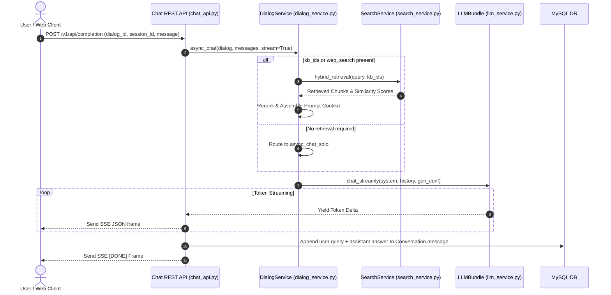

# Complete Chat Call Flow & Execution Sequence

## Level 1: Conceptual Overview

The complete chat execution flow traces a user query from HTTP request arrival to final SSE response termination. It handles dialog resolution, session retrieval, optional web search / knowledge base retrieval, reranking, prompt compilation, LLM streaming, citation parsing (`##0$$`), and database persistence.

---

## Level 2: Implementation Details

### Execution Step Sequence

---

### Key Code Entry Points

1. **REST API Endpoint**: `completion()` in [chat_api.py](file:///home/logan78/Desktop/ragflow/api/apps/restful_apis/chat_api.py#L1)
2. **Dialog Execution Engine**: `async_chat()` in [dialog_service.py](file:///home/logan78/Desktop/ragflow/api/db/services/dialog_service.py#L580)
3. **Solo Chat Fallback**: `async_chat_solo()` in [dialog_service.py](file:///home/logan78/Desktop/ragflow/api/db/services/dialog_service.py#L292)
4. **Mindmap Generator**: `gen_mindmap()` in [dialog_service.py](file:///home/logan78/Desktop/ragflow/api/db/services/dialog_service.py#L1200)

---

### Data Sanitization (`_sanitize_json_floats`)

In [chat_api.py](file:///home/logan78/Desktop/ragflow/api/apps/restful_apis/chat_api.py#L62-L91):
Retrieval scores (`similarity`, `vector_similarity`) can compute to `NaN` when aggregations evaluate over empty chunk sets. `_sanitize_json_floats(obj)` replaces `NaN`/`Infinity` floats with `None` before emitting SSE frames, preventing client JSON parsing errors.
