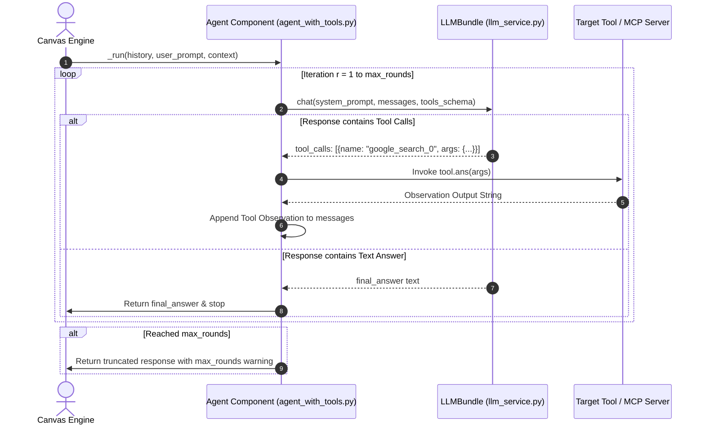

# Agent Autonomous ReAct Loop Flow

## Level 1: Conceptual Overview

The **Autonomous ReAct Loop** manages multi-step tool execution. In each iteration, the agent asks the LLM for the next step. If the LLM generates a tool call, the agent invokes the requested tool, appends the tool observation output to internal history, and loops. If the LLM returns text output without tool calls or reaches `max_rounds`, the loop terminates.

---

## Level 2: Implementation Details

### Sequence Execution Diagram



---

### Code Execution Method (`_run`)

In [agent_with_tools.py](file:///home/logan78/Desktop/ragflow/agent/component/agent_with_tools.py#L120-L220):

```python
for round_idx in range(self._param.max_rounds):
    # Invoke LLM chat driver with current tool schema definitions
    ans = self.chat_mdl.chat(system_prompt, history, gen_conf)
    
    if not ans.get("tool_calls"):
        # No tool calls requested: final output achieved
        return ans["content"]
        
    for call in ans["tool_calls"]:
        tool_name = call["function"]["name"]
        arguments = json.loads(call["function"]["arguments"])
        # Execute tool observation
        tool_obj = self.tools[tool_name]
        result = tool_obj.ans(arguments)
        # Append observation turn to messages history
        history.append({"role": "tool", "tool_call_id": call["id"], "content": str(result)})
```
