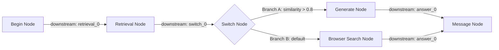

# Graph Edges & Routing Mechanics

## Level 1: Conceptual Overview

**Graph Edges** define dependency links and data flow vectors between nodes in a canvas workflow DAG. RAGFlow supports direct execution edges (`downstream` / `upstream`), conditional branch edges (`Switch` / `Categorize` routes), and subgraph boundary connections (`Loop` / `Iteration` parents).

---

## Level 2: Implementation Details

### Source File Map
- **Go DAG Compilation**: [compile.go](file:///home/logan78/Desktop/ragflow/internal/agent/canvas/compile.go#L50-L100)
- **Multi-Branch Compiler**: [multibranch.go](file:///home/logan78/Desktop/ragflow/internal/agent/canvas/multibranch.go#L1)
- **Python Canvas DSL**: [agent/canvas.py](file:///home/logan78/Desktop/ragflow/agent/canvas.py#L60-L80)

---

### Edge Data Structure & Validation

In `CanvasComponent` ([canvas.go](file:///home/logan78/Desktop/ragflow/internal/agent/canvas/canvas.go#L65-L70)):

```go
type CanvasComponent struct {
    Obj        CanvasComponentObj `json:"obj"`
    Downstream []string           `json:"downstream"` // Outgoing edges to child nodes
    Upstream   []string           `json:"upstream"`   // Incoming edges from parent nodes
}
```



---

### Multi-Branch & Conditional Routing

For conditional routing nodes like `Switch` ([switch.py](file:///home/logan78/Desktop/ragflow/agent/component/switch.py#L56)):
The node evaluates logical condition rules in priority order. Execution control is forwarded ONLY along downstream edges matching the successful branch index, while unselected downstream paths are skipped.
