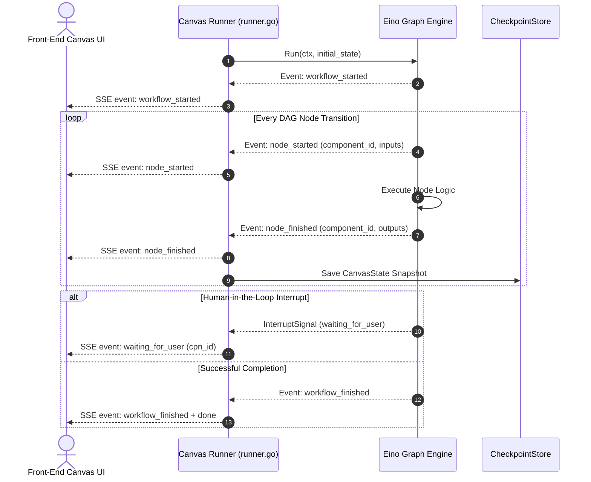

# Workflow Execution Flow & Event Streaming

## Level 1: Conceptual Overview

The **Workflow Execution Flow** controls how canvas graph invocations are scheduled, monitored, and streamed to web clients. As each graph node starts and finishes execution, SSE events (`workflow_started`, `node_started`, `node_finished`, `message`, `workflow_finished`) are pushed over HTTP channels.

---

## Level 2: Implementation Details

### Runner Event Protocol (`runner.go`)

In [internal/agent/canvas/runner.go](file:///home/logan78/Desktop/ragflow/internal/agent/canvas/runner.go#L78-L120):

```go
type RunEvent struct {
    Type      string `json:"type"`
    Data      string `json:"data"`
    MessageID string `json:"message_id"`
    CreatedAt int64  `json:"created_at"`
    SessionID string `json:"session_id"`
}
```



---

### Node Event Payload Schemas

#### 1. `node_started` Data Payload
```json
{
  "inputs": {"query": "Summarize financial report"},
  "created_at": 1723400000.0,
  "component_id": "retrieval_0",
  "component_name": "Retrieval",
  "component_type": "retrieval",
  "thoughts": "Retrieving document chunks for query"
}
```

#### 2. `node_finished` Data Payload
```json
{
  "inputs": {"query": "Summarize financial report"},
  "outputs": {"chunks": [{"id": "c1", "content": "..."}]},
  "component_id": "retrieval_0",
  "component_name": "Retrieval",
  "component_type": "retrieval",
  "elapsed_time": 0.42
}
```
