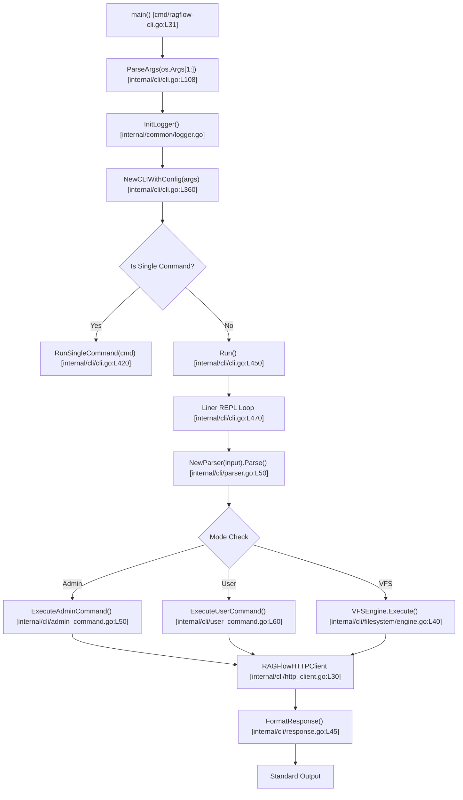

# RAGFlow CLI Overview

## Level 1: Conceptual Explanation

`ragflow-cli` is the native command-line interface for the RAGFlow RAG system, implemented in Go. It provides interactive administration, programmatic scripting, host management, virtual filesystem navigation, and fine-grained control over RAGFlow services, datasets, document parsers, and agent workflows.

### Core Objectives & Dual Modes
1. **Interactive REPL Mode**: An interactive shell environment powered by `github.com/peterh/liner`, enabling auto-completion, line editing, persistent command history, and real-time execution feedback.
2. **Single-Command Batch Mode**: Direct command execution from standard terminal shells (`bash`/`zsh`) for automated pipelines, cron tasks, and CI/CD integration.
3. **Dual Operating Scopes**:
   - **User Mode (`APIMode`)**: Interacts with user-level REST endpoints to query knowledge bases, upload files, control chunking pipelines, configure LLM/embedding models, and manage workflow agents.
   - **Admin Mode (`AdminMode`)**: Operates on system administrator ports (`9383`/`9381`) to manage server processes, service lifecycle (`startup`, `shutdown`, `restart`), tenant workspaces, multi-node clustering, and telemetry.
4. **Virtual Filesystem (VFS)**: Abstraction overlaying REST APIs into a familiar UNIX-like hierarchical directory structure (`/datasets/{name}/files`), enabling traditional filesystem commands like `ls`, `cat`, `mkdir`, `rm`, and `search`.

---

## Level 2: Implementation Details

### Architecture & Package Organization

The CLI implementation is located in [`cmd/ragflow-cli.go`](file:///home/logan78/Desktop/ragflow/cmd/ragflow-cli.go) and the [`internal/cli/`](file:///home/logan78/Desktop/ragflow/internal/cli/) package.

```
internal/cli/
├── README.md               # CLI design & VFS documentation
├── admin_command.go        # Administrative REST handlers & dispatchers
├── admin_parser.go         # SQL-like grammar parser for ADMIN commands
├── benchmark.go            # Benchmark test runner utilities
├── cli.go                  # Main CLI lifecycle, flags parser, REPL loop
├── cli_http.go             # High-level HTTP API call wrappers
├── cli_test.go             # CLI unit tests
├── common_command.go       # Shared utility commands across user/admin modes
├── crypt.go                # Cryptographic hashing & password helpers
├── dev_parser.go           # Internal developer/debug command parser
├── filesystem/             # Virtual Filesystem engine & providers
│   ├── base.go             # Base VFS node interface & provider contracts
│   ├── dataset.go          # VFS dataset directory provider
│   ├── engine.go           # VFS path resolution & command routing
│   ├── file.go            # VFS file object provider
│   ├── skill.go           # Agent skill hub filesystem integration
│   ├── skill_install.go    # Skill installation handlers
│   ├── skill_uninstall.go  # Skill uninstallation handlers
│   └── types.go            # VFS node types & command structures
├── http_client.go          # Custom HTTP client with JWT/API key auth
├── lexer.go                # Lexical scanner & tokenizer for SQL-like grammar
├── parser.go               # Top-level recursive descent parser
├── response.go             # Table & plain-text response formatters
├── table.go                # ASCII table renderer
├── types.go                # Token constants & Command structures
├── user_command.go         # User mode REST handlers & execution logic
├── user_parser.go          # Grammar parser for USER commands
└── user_parser_test.go     # Unit tests for user grammar parsing
```

### Key Data Structures

#### 1. CLI Configuration (`CommandLineConfig`)
Defined in [`internal/cli/cli.go#L76-L85`](file:///home/logan78/Desktop/ragflow/internal/cli/cli.go#L76-L85):
```go
type CommandLineConfig struct {
	CLIMode           CommandLineMode
	AdminClientConfig *AdminModeConfig
	APIClientConfig   APIModeConfig
	ShowHelp          bool
	Verbose           bool
	Interactive       bool
	OutputFormat      OutputFormat
	Command           *string
}
```

#### 2. Configuration File Structure (`ConfigFile`)
Defined in [`internal/cli/cli.go#L49-L55`](file:///home/logan78/Desktop/ragflow/internal/cli/cli.go#L49-L55):
```go
type ConfigFile struct {
	Host         string                      `yaml:"host"`
	APIKey       string                      `yaml:"api_key"`
	UserName     string                      `yaml:"user_name"`
	Password     string                      `yaml:"password"`
	APIServerMap map[string]*APIServerConfig `yaml:"api_servers"`
}
```

#### 3. Output Formats (`OutputFormat`)
Defined in [`internal/cli/cli.go#L58-L64`](file:///home/logan78/Desktop/ragflow/internal/cli/cli.go#L58-L64):
- `table` (`OutputFormatTable`): Rendered ASCII table with grid borders.
- `plain` (`OutputFormatPlain`): Unformatted whitespace-separated text suitable for piping (`grep`, `awk`).
- `json` (`OutputFormatJSON`): Structured JSON payload.

---

## Call Chain & Execution Flow



---

## References & Source Links

- [`cmd/ragflow-cli.go:L31-L80`](file:///home/logan78/Desktop/ragflow/cmd/ragflow-cli.go#L31-L80) - Main CLI entry point.
- [`internal/cli/cli.go:L108-L350`](file:///home/logan78/Desktop/ragflow/internal/cli/cli.go#L108-L350) - Command-line argument parsing and configuration binding.
- [`internal/cli/types.go:L20-L245`](file:///home/logan78/Desktop/ragflow/internal/cli/types.go#L20-L245) - Command and Token definitions.
- [`internal/cli/filesystem/engine.go:L1-L150`](file:///home/logan78/Desktop/ragflow/internal/cli/filesystem/engine.go#L1-L150) - Virtual Filesystem Engine implementation.
