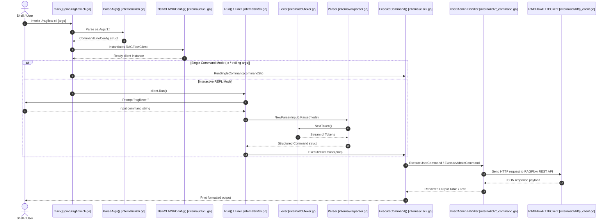

# Command Entry Points

## Level 1: Conceptual Explanation

The CLI entry point coordinates binary initialization, signal handling, environment and configuration loading, mode determination (User vs. Admin), input parsing, and dispatching execution to HTTP services or the Virtual Filesystem (VFS). 

It operates via two distinct modes:
1. **Interactive REPL Mode**: Continuously prompts the user for SQL-like or filesystem commands using an auto-completing shell loop.
2. **Single-Command Batch Mode**: Receives arguments directly via shell parameters (`ragflow-cli -t <token> "LIST DATASETS;"`), executes the command, prints formatted output, and exits.

---

## Level 2: Implementation Details

### Binary Entry Point: `cmd/ragflow-cli.go`

Located in [`cmd/ragflow-cli.go`](file:///home/logan78/Desktop/ragflow/cmd/ragflow-cli.go#L31-L80):

```go
func main() {
	arguments, err := cli.ParseArgs(os.Args[1:])
	if err != nil {
		return
	}

	if arguments.ShowHelp {
		cli.PrintUsage()
		return
	}

	logLevel := "warn"
	if arguments.Verbose {
		logLevel = "info"
	}

	if err = common.InitLogger(logLevel, common.FileOutput{}, "ragflow-cli"); err != nil {
		fmt.Printf("Warning: Failed to initialize logger: %v\n", err)
	}

	client, err := cli.NewCLIWithConfig(arguments)
	if err != nil {
		fmt.Printf("Failed to create CLI: %v\n", err)
		os.Exit(1)
	}

	sigChan := make(chan os.Signal, 1)
	signal.Notify(sigChan, syscall.SIGINT, syscall.SIGTERM)
	go func() {
		<-sigChan
		client.Cleanup()
		os.Exit(0)
	}()

	if arguments.Command != nil {
		if err = client.RunSingleCommand(arguments.Command); err != nil {
			fmt.Printf("Command execution failed: %v\n", err)
			os.Exit(1)
		}
	} else {
		if err = client.Run(); err != nil {
			fmt.Printf("CLI error: %v\n", err)
			os.Exit(1)
		}
	}
}
```

### Argument Parsing Sequence: `ParseArgs`

Located in [`internal/cli/cli.go#L108-L350`](file:///home/logan78/Desktop/ragflow/internal/cli/cli.go#L108-L350):

```go
func ParseArgs(args []string) (*CommandLineConfig, error) {
	commandLineConfig := &CommandLineConfig{
		CLIMode:           APIMode,
		AdminClientConfig: nil,
		ShowHelp:          false,
		Verbose:           false,
		Interactive:       true,
		OutputFormat:      OutputFormatTable,
		Command:           nil,
	}
    // Pass 1: Parse global options (-o, -v, --admin, --help)
    // Pass 2: Bind API host, port, token, user, password, config file (rf.yml)
}
```

### REPL Initialization & Interactive Loop

Located in [`internal/cli/cli.go#L450-L530`](file:///home/logan78/Desktop/ragflow/internal/cli/cli.go#L450-L530):
1. **Liner Shell**: Initializes `liner.NewLiner()` for terminal line editing.
2. **Auto-Completer**: Configures dynamic completion callback `liner.SetCompleter()` matching SQL keywords (`LOGIN`, `CREATE`, `DROP`, `LIST`, `SHOW`, `GRANT`, `REVOKE`, `SET`, `SEARCH`, `USE`) and virtual filesystem paths (`/datasets`, `/datasets/kb1`).
3. **History File**: Persists shell command history to `~/.ragflow_cli_history`.
4. **Execution Cycle**:
   - `line, err := liner.Prompt("ragflow> ")`
   - Read line -> Parse with [`NewParser(line).Parse(mode)`](file:///home/logan78/Desktop/ragflow/internal/cli/parser.go#L50)
   - Dispatch to [`ExecuteCommand(cmd)`](file:///home/logan78/Desktop/ragflow/internal/cli/cli.go#L600)
   - Format and output response using [`FormatResponse()`](file:///home/logan78/Desktop/ragflow/internal/cli/response.go#L45).

---

## Complete Call Chain Execution Flow



---

## References & Source Links

- [`cmd/ragflow-cli.go:L31-L80`](file:///home/logan78/Desktop/ragflow/cmd/ragflow-cli.go#L31-L80) - CLI entry point definition.
- [`internal/cli/cli.go:L108-L350`](file:///home/logan78/Desktop/ragflow/internal/cli/cli.go#L108-L350) - Argument parsing implementation.
- [`internal/cli/cli.go:L450-L530`](file:///home/logan78/Desktop/ragflow/internal/cli/cli.go#L450-L530) - Interactive Liner REPL loop.
- [`internal/cli/parser.go:L35-L62`](file:///home/logan78/Desktop/ragflow/internal/cli/parser.go#L35-L62) - Parser constructor and top-level entry point.
